## Начало  

Эта статья основана на материале, опубликованном на [Teletype](https://teletype.in/@iris_cm/commands). Я переписал и немного изменил содержание для удобства чтения, однако оригинальный материал, команды и их описание принадлежат автору оригинальной статьи и создателям бота. Я не являюсь автором бота, статьи или команд.  

### Обозначения параметров команд  

- Параметры, указанные в фигурных скобках, например, так **_{число}_** — это настраиваемые значения. Указывать их нужно без фигурных скобок.  
- Параметры, указанные в квадратных скобках, например, так **_[минута|час|сутки|неделя]_** — предполагает выбор значения из предлагаемого списка.  
- Параметры со значением **_{период}_** — это пара **_{число [минута|час|сутки|неделя|месяц|год]}_**, определяющая срок применения команды. **_{число}_** — необязательный параметр. Пример: **_«кик неактив 2 дня»_**  
- Параметры со значением **_{ссылка}_** — это ссылка на страницу пользователя (<https://t.me/durov>) или обращения к пользователю (@durov), или репост сообщения нужного пользователя. ID пользователя можно узнать командой **«!ид @ссылка»**.  
- Параметр **_{enter}_** — перенос строки.  

### То, что важно знать  

- Все команды **Iris | Чат-менеджера** поддерживают префиксы «**!**», «**.**», «**/**» и «**Ирис**», «**Ириска**». Также многие команды можно писать **без** префиксов.  
- Просим вас помечать баны пользователей причиной **«спам» / «рейдер»** и т.п., если нарушители распространяют спам / рейдят. Так нам будет легче фильтровать списки банов и быстрее заносить таких в **Ирис-антиспам**.
    _— Причина бана указывается на следующей строке. Также причину можно вписать в предупреждение и мут._ 💌  

* * *

## 1. Команды модерации  

> В системе Ириса предусмотрено 5 рангов модераторов, включая 0 ранг — ранг обычного участника. 5 ранг — ранг создателя, ему доступны все команды.  

### Назначение ранга модератора  

・**+Модер {ссылка}** — 1 ранг (Младший модератор)
_— Синоним: +админ, !модер_
・**+Модер 2 {ссылка}** — 2 ранг (Старший модератор)
_— Синоним: +админ 2, !модер 2_
・**+Модер 3 {ссылка}** — 3 ранг (Младший администратор)
_— Синоним: +админ 3, !модер 3_
・**+Модер 4 {ссылка}** — 4 ранг (Старший администратор)
_— Синоним: +админ 4, !модер 4_
・**+Модер 5 {ссылка}** – 5 ранг (Создатель)
_— Синоним: +админ 5, !модер 5_  

Второй вариант написания:  
・Повысить {ссылка} — 1 ранг (Младший модератор).  
・Повысить 2 {ссылка} — 2 ранг (Старший модератор).  
・Повысить 3 {ссылка} — 3 ранг (Младший администратор).  
・Повысить 4 {ссылка} — 4 ранг (Старший администратор).  
・Повысить 5 {ссылка} — 5 ранг (Создатель).  

Третий вариант написания:  
・!модер {ссылка} — 1 ранг (Младший модератор)  
・!!модер {ссылка} — 2 ранг (Старший модератор)  
・!!!модер {ссылка} — 3 ранг (Младший администратор)  
・!!!!модер {ссылка} — 4 ранг (Старший администратор)  
・!!!!модер {ссылка} и потом «повысить {ссылка}» – 5 ранг (Создатель)  

・**Повысить {ссылка}** — повышает на 1 ранг модератора.
・**Понизить {ссылка}** — понижает на 1 ранг модератора.  

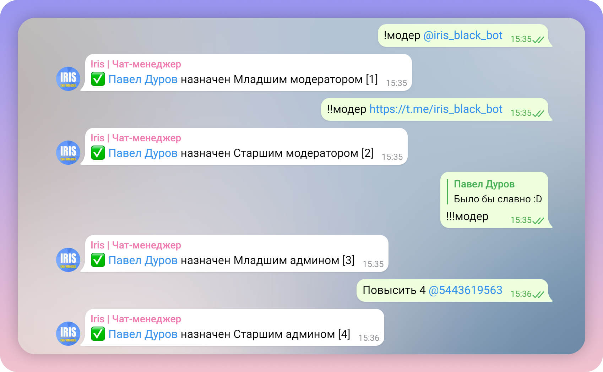  

### Снятие ранга модератора  

・**Снять / Разжаловать {ссылка}** — снять статус с модератора.  

・**Снять вышедших** — снять статус со всех вышедших модераторов (они помечены значком «➖» в списке модераторов).  

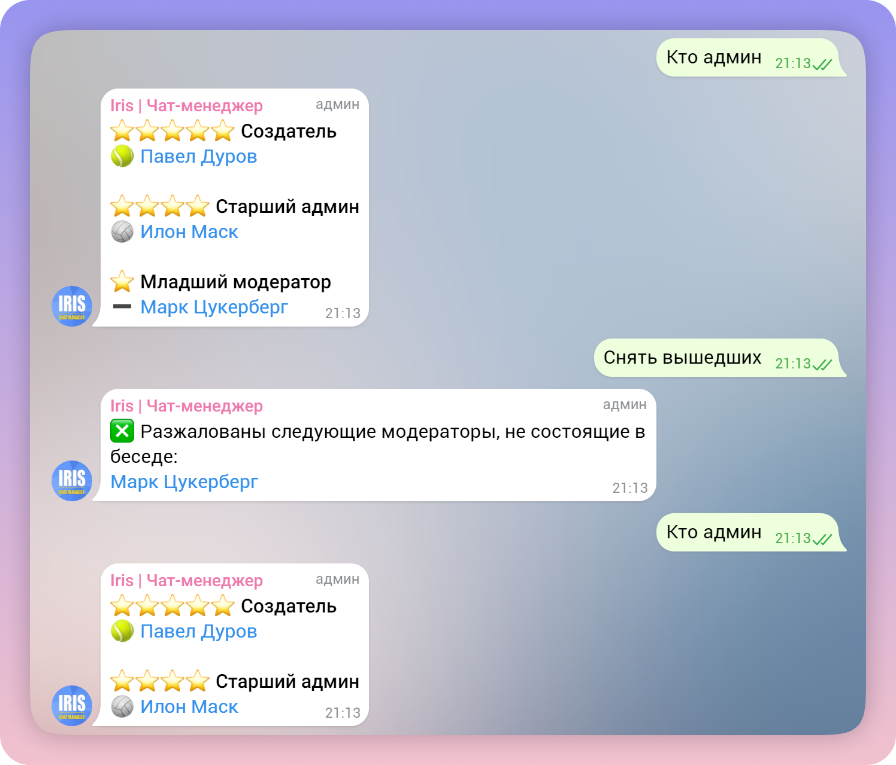  

・**!Снять всех** / **!Разжаловать всех** — снять статус со всех модераторов чата, даже с создателя ([восстановить права создателя](#восстановление-прав-создателя-5-ранг)).  

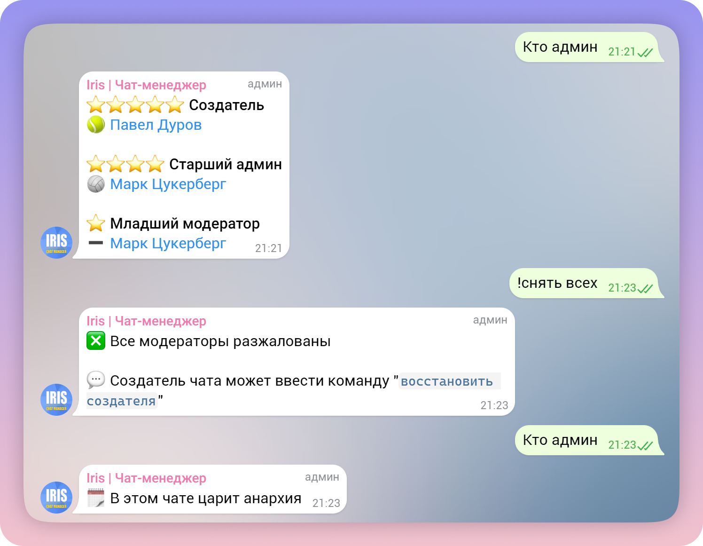  

### Назначение и разжалование модератора в сетке чатов  

・**Сетка {номер} !модер** — назначить модератором данного ранга в каждой из чатов в сетке. Количество «!» означает номер ранга модерации.
・**Сетка разжаловать {ссылка}** — снять модератора в каждом чате в вашей сети чатов.  

### Снятие полномочий  

・**!Снимаю полномочия** — снять свой статус модератора.
_— Синонимы: !ухожу в отставку, !разжаловать меня_
・**Сетка ухожу в отставку** — снять свой статус модератора во всей сетке.
_— Синоним: сетка снимаю полномочия_  

### Восстановление прав создателя (5 ранг)  

・**Восстановить создателя** — восстановить права создателя в конкретном чате (5 ранг). Может использовать только создатель чата.
・**Сетка восстановить создателя** — восстановить права создателя во всей сетке чатов (5 ранг). Может использовать только создатель чата.  

> Если вы не являетесь создателем чата, то вы не сможете самостоятельно восстановить свой ранг. Для этого попросите повысить вас других модераторов.  

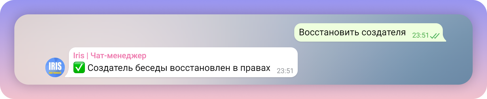  

### Завещание  

Вы можете оставить завещание на свой резервный аккаунт или доверенное лицо, которое получит доступ к вашему аккаунту в случае его утери. При утере доступа к вашему аккаунту, указанный резервный аккаунт или доверенное лицо смогут вступить в права наследства и восстановить чаты и содержимое вашего мешка.  

・**+Завещание {ссылка}** — оставить завещание на указанного пользователя.
_— Синоним: +наследство_
・**Моё завещание** — краткая информация о вашем завещании.
・**\-Завещание** — аннулировать завещание.
_— Синоним: -наследство_  

・**Вступить в наследство {ссылка}** — вступить в наследство от указанного пользователя, если он оставлял завещание.  

После вступления в наследство вы можете восстановить права создателя командой «[Восстановить создателя](#восстановление-прав-создателя-5-ранг)».  

> Для подтверждения прав наследства, необходимо обратиться к агентам поддержки, где вам окажут помощь и предоставят дополнительную информацию о процессе восстановления данных.  

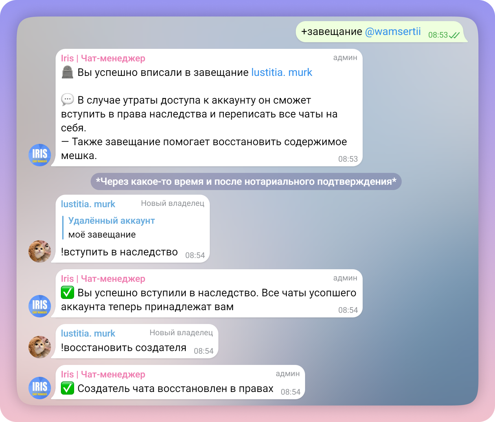  

### Передача создателя  

・**!Передать создателя** — передать права создателя в Ирисе указанному пользователю. Пользователь должен будет потом ввести команду «**Восстановить создателя**».  

> Отнеситесь к передаче прав истинного создателя серьёзно. Учтите, что **самостоятельно** вернуть себе права вы **не сможете**.  
> Также необходимо **передать права создателя** пользователю **в самом Telegram**. Для передачи прав необходимо установить двухфакторную аунтификацию. Если вы еще этого не сделали, придется подождать **неделю**.  

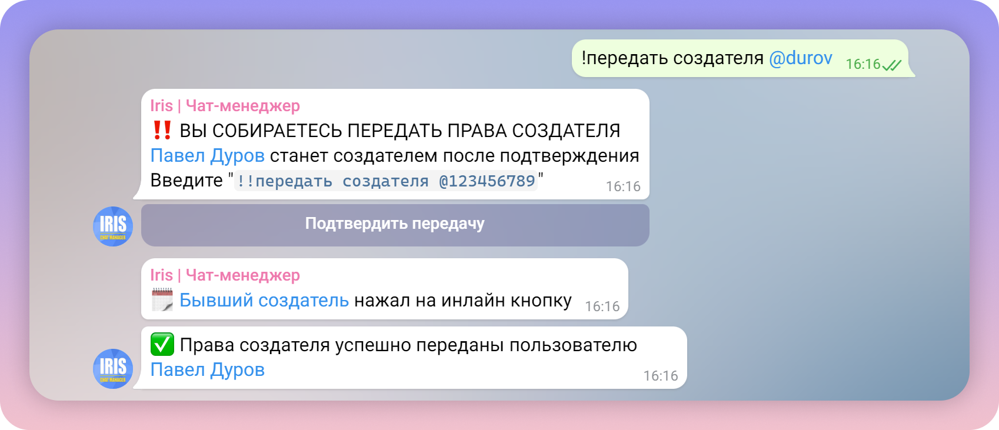  

### Просмотр состава модерации  

・**Кто админ** — вызвать список модераторов в чате.
_— Синонимы: а судьи кто, кто здесь власть, !staff, !управляющие, !админы_
・**Кто назначил {ссылка}** — посмотреть кто назначил указанного пользователя.  

🟢 — модератор онлайн
⚪️ — модератор оффлайн
➖ — модератор не в чате  

> **・+Мой онлайн** — включить отображение своего статуса в сети.  

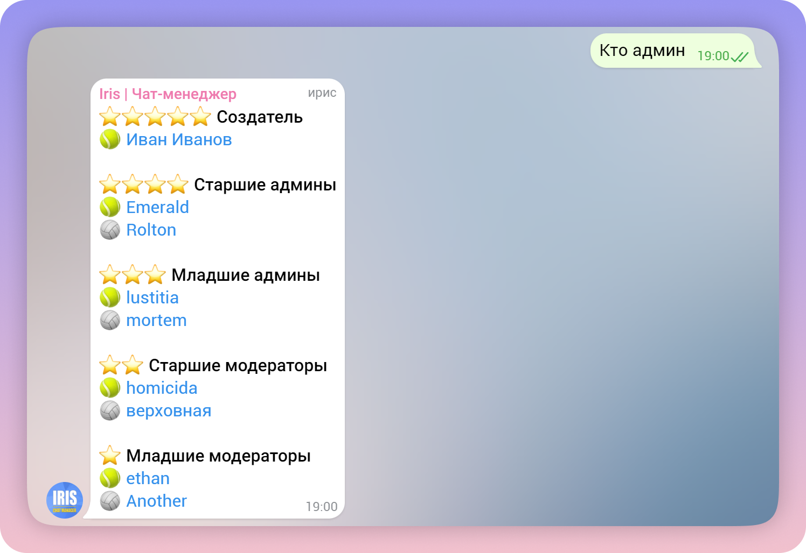  

### Созыв модерации  

・**Созвать модеров** — позвать состав модерации. Вызывается не более 20 модераторов. Если их больше, уведомление придёт недавно активным.
_— Синонимы: позвать админов, позвать модеров, созвать админов_  

> Воспользуйтесь кнопкой «**➖ Удалить упоминания**», чтобы разом удалить все уведомления от Ириса о созыве модерации.  

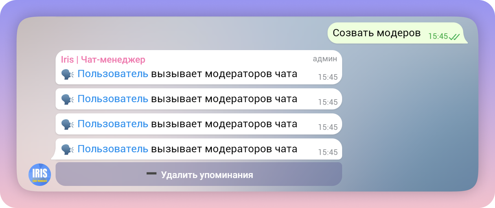  

> **Ограничить назначение:** дк повысить (ранг)
> **Ограничить вызов админов:** дк вызов админов (ранг)
> **Ограничить вызов списка админов:** дк кто админ (ранг)  

**[Вернуться к оглавлению](#начало)**  

## 2. Система банов и предупреждений  

> Вышестоящий по рангу модератор может изменять или отменять решения нижестоящих модераторов. Нижестоящие модераторы не могут изменять или отменять решения вышестоящих модераторов.  

При выдаче наказания можно и нужно указывать причину в следующей строке.  

### Предупреждения  

・**Варн {период} {ссылка}** — выставляется одно предупреждение пользователю на срок, указанный в команде. На следующей строке можно написать причину предупреждения.
— _Синонимы: пред, предупреждение, /warn, !warn, !пред_  

> **Например:**
> Варн @username
> Флуд

_・_**Варны {ссылка}** — список текущих предупреждений пользователя.
_・_**Варнлист** — список последних предупреждений чата (аналог банлиста).  

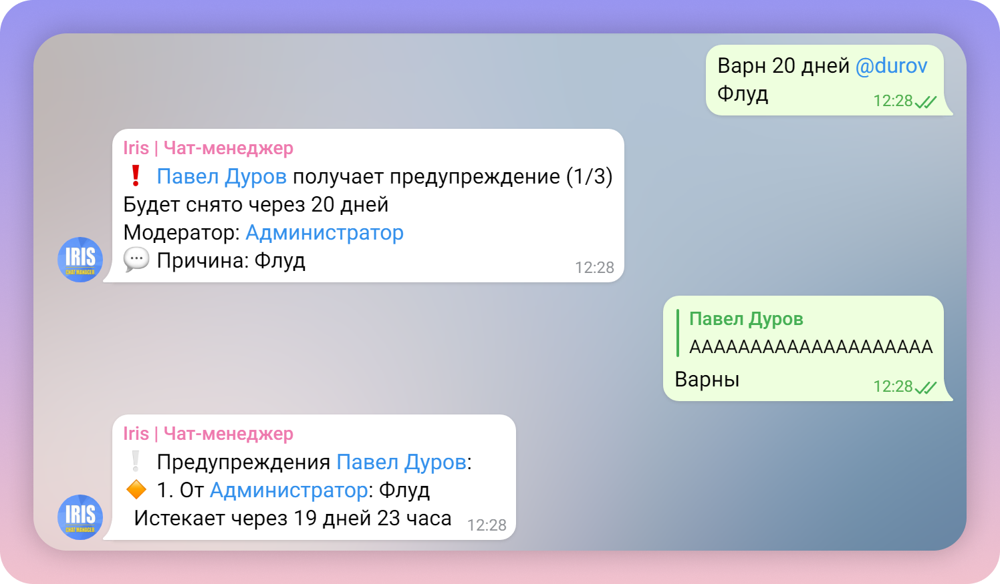  

### Снятие предупреждений  

・**\-Варн {ссылка}** — снимет последнее выданное предупреждение.
・**Снять варны {число} {ссылка}** — снимет определенное число предупреждений пользователя.
・**Снять варн номер {число} {ссылка}** — снимет определённое предупреждение с пользователя.
・**Снять все варны {ссылка}** — снимет все предупреждения с пользователя.  

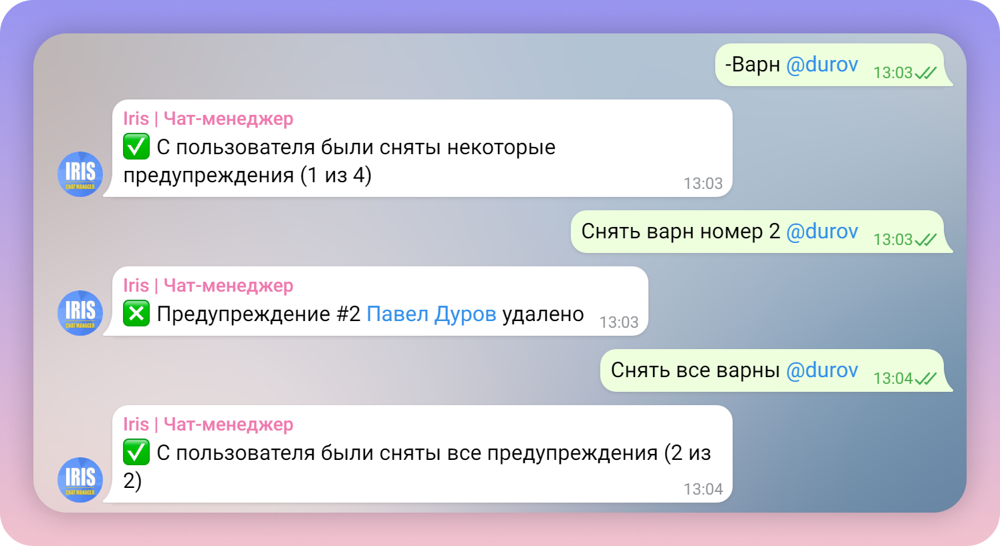  

### Настройка предупреждений  

・**Варны лимит {число}** — устанавливает число предупреждений, по достижению которых пользователь исключается из чата (по умолчанию 3).
・**Варны чс {период}** — устанавливает срок бана по достижению лимита предупреждений.
・**Варны период {период}** — устанавливает срок хранения предупреждения.  

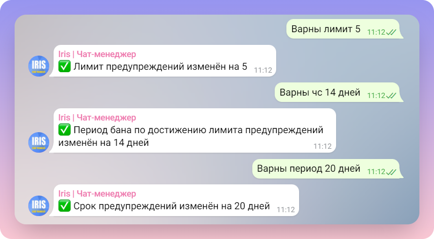  

> **Ограничить выдачу варнов:** дк выдача варнов (ранг)
> **Ограничить снятие варнов:** дк снятие варнов (ранг)
> **Ограничить просмотр варнов учасника:** дк предупреждения пользователя (ранг)  

### Мут  

・**Мут {срок} {ссылка}** — запрещает отправлять сообщения выбранному пользователю на определённый период (по умолчанию 1 неделя).
_— Синонимы: заткнуть, мут, mute_  

> **Например:**
> Мут @username
> Флуд

・**\-Мут {ссылка}** — снимает мут с пользователя.
_— Синонимы: снять мут, говори, unmute, размут_  

・**Муты** — список пользователей с ограничением в переписке.
・**Проверить мут {ссылка}** — проверяет, заглушен ли пользователь или нет.  

・**Мут период {период}** — устанавливает срок хранения молчания по умолчанию.
_Минимальный период:_ 1 минута  

> Настроить исход мута можно с помощью триггеров  

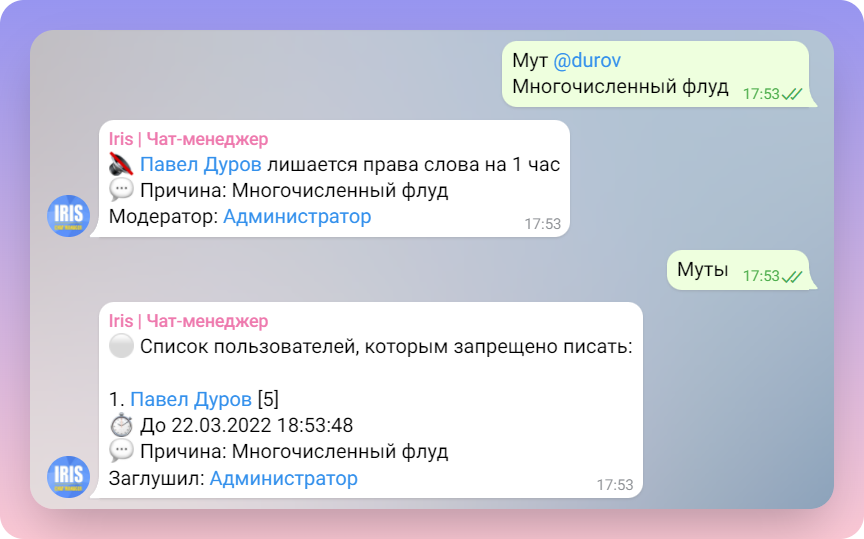  

> **Ограничить выдачу/снятие мута:** дк выдача мута (ранг)
> **Ограничить проверку наличия мута:** дк проверить мут (ранг)
> **Ограничить список замутенных:** дк список мутов (ранг)  

### Команды банов  

**・Бан {период} {ссылка}** — блокирует пользователя на заданный период времени. По умолчанию банит навсегда.
_— Синоним: чс, !ban, !permban_  

Просим вас помечать баны пользователей причиной «**Спам**» / «**Рейдер**» и т.п., если они распространяют спам / рейдят, так нам будет легче фильтровать списки банов и быстрее заносить таких в **[Ирис-антиспам](#ирис-антиспам)**.  

> **Например:**
> Бан 1 месяц @username
> Спам

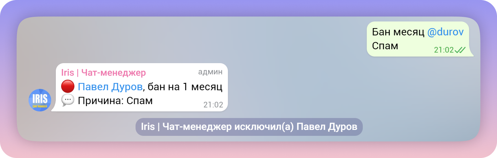  

・**Бан период {период}** — устанавливает срок блокировки по умолчанию.  

**・Разбан {ссылка} / Вернуть {ссылка}** — снимает блокировку с пользователя. После разблокировки пользователь сможет самостоятельно вернуться в чат по ссылке-приглашению или его могут добавить другие участники.
_— Синоним: !unban_
・**Причина {ссылка}** — выводит причину, указанную при бане пользователя, а так же ссылку на модератора, который забанил.  

**・Кик {ссылка}** — исключает пользователя из чата. В таком случае Ирис не будет мешать пользователю вернуться в чат.
_— Синоним: !kick_  

**・!Амнистия** — снимает баны со всех участников чата.
**・Банлист** — покажет список забаненных в данном чате.  

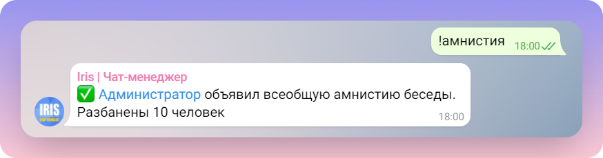  

> **Ограничить выдачу бана:** дк бан (ранг)
> **Ограничить разбан/вернуть:** дк разбан (ранг)
> **Ограничить банлист:** дк банлист (ранг)
> **Ограничить причину:** дк причина бана (ранг)
> **Ограничить амнистию:** дк амнистия (ранг)
> **Ограничить кик:** дк кик (ранг)  

**[Вернуться к оглавлению](#начало)**  

## 3. Триггеры и автоматические наказания  

**Триггер** — реакция бота на определённое действие в чате, в результате которого выполняется указанная вами команда или же указанный вами исход какой-либо команды автоматически.  

Благодаря триггерам, можно настраивать автоматические наказания в чате, расширять возможности других команд, менять исход команды, давать наказания модераторам и многое другое!  

### Подробнее в этой статье — <https://teletype.in/@iris_cm/triggers>  

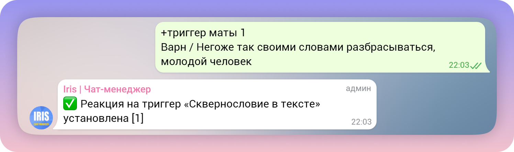  

**[Вернуться к оглавлению](#начало)**  

## 4. Настройка доступа команд  

> Доступ ко всем командам Ириса можно настроить по рангам, дать доступ всем или вовсе отключить.  

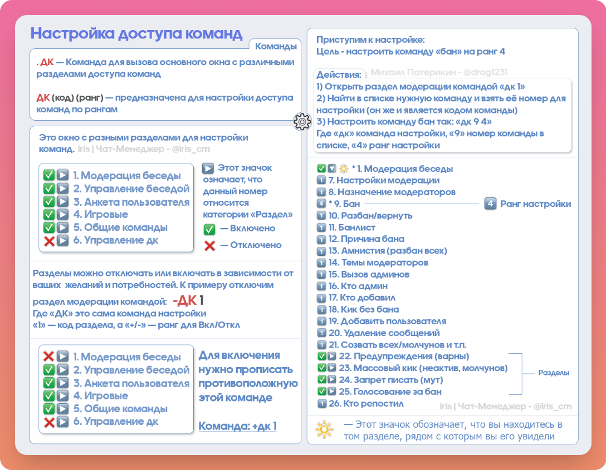  

Если выключить или ограничить блок команд, подпункты будут так же ограничены, например «**Блок Модерация**»_._ Проверить, что является главной командой-блоком можно по команде «**Доступ команд**»_._ Чтобы ограничить блок, стоит всего лишь сделать это для главной команды.  

### Просмотр доступа команд  

**・Доступ команд** — выведет список доступности команд. А также в скобках содержит код / номер команды, которую можно вставлять в команды настройки доступности.
_— Синоним: !дк, .дк, /дк_  

**・Мой доступ команд** — выведет список доступности команд лично для вас (что вам доступно, а что нет).
_— Синоним: !мдк, .мдк, мой дк_  

▶️ — означает, что данный номер относится к категории «**Раздел**»;
✅ — означает, что раздел / команда включён(а);
❌ — означает, что раздел / команда выключен(а).  

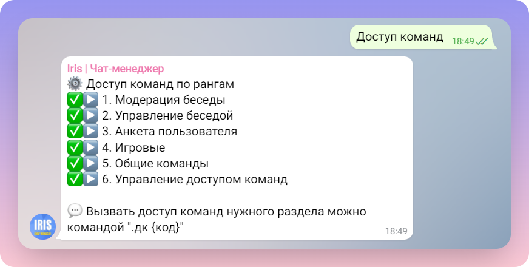  

### Включение команды  

**・Дк {название или цифра} 0** — сделать команду доступную для всех.
_— Синоним: +дк {название или цифра}_  

> **Пример 1:** +дк пинг / +дк 181
> **Пример 2:** !дк пинг 0 / !дк 181 0  

Где «**пинг**» — код команды; «**181**» — номер команды (оба этих значения ограничивают одну команду — «**Пинг**»), «**0**» — 0 ранг, т.е. доступна всем.  

  

### Ограничение команды по рангу  

**・Дк {название или цифра} {ранг}** — доступ к команде только с уровня модерации _{ранг}._  

> **Например:** !дк бан 2  

Где «**бан**» — код команды, «**2**» — ранг, с которого команда будет доступна.  

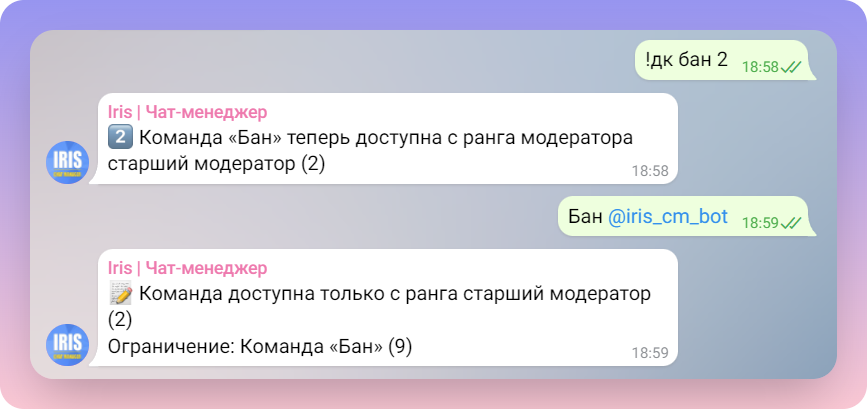  

### Отключение команды  

**・Дк {название или цифра} 6** — отключить команду (никто не сможет использовать эту команду).
— Синоним: -дк {название или цифра}  

> **Пример 1:** -дк пинг / -дк 181
> **Пример 2:** !дк пинг 6 / !дк 181 6  

Где «**пинг**» — код команды; «**181**» — номер команды (оба этих значения ограничивают одну команду — «**Пинг**»), «**6**» — 6 ранг, т.е. отключение.  

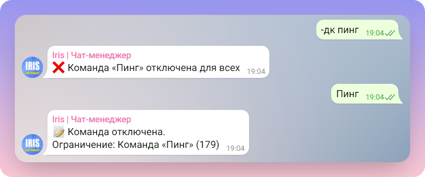  

### Импорт доступа команд  

**・Импорт команд из {код чата}** — копирует «доступ команд» из чата, чей код взяли — в вашу. При этом, вы должны являться 5 рангом в своем чате и иметь доступ к _«доступ команд»_ в чате, откуда переносите.  

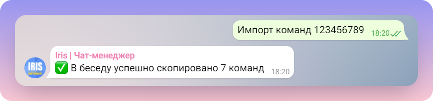  

### Сброс настроек  

**・!Сброс команд** — сбрасывает абсолютно все настройки доступа команд.  

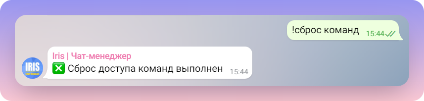  

### Отключение оповещения о доступности команды  

**・-Команды** — выключает оповещения о доступности команд.
**・+Команды** — включает оповещения о доступности команд.  

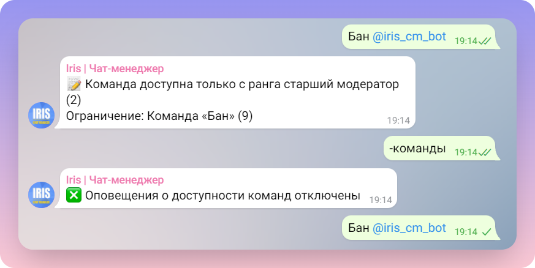  

### Дополнительные команды  

**・-Рп / +Рп** — выключение / включение рп-команд.
**・-Браки / +Браки** — выключение / включение раздела «[**Браки**](#21-модуль-браки)».  

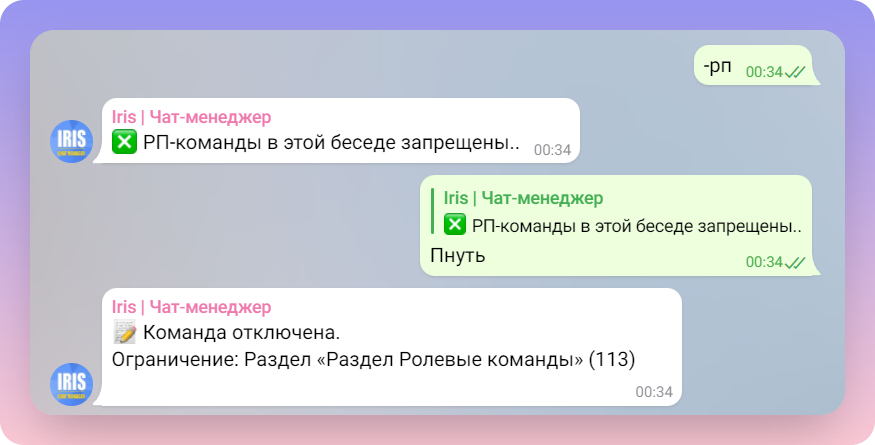  

> **Ограничить мой доступ команд:** дк мдк (ранг)
> **Ограничить вызов дк:** дк вызов дк (ранг)  

**[Вернуться к оглавлению](#начало)**  

## 5. Чистка чата  

> Перед тем, как начать чистку чата, убедитесь в правильности написания команды. Из-за невнимательности вы можете снести чат.  

### Удаление сообщений  

**・-смс** — удаляет указанное сообщение (вместе с вашим).  

> Имейте в виду: нельзя удалить сообщения старше 48 часов.  

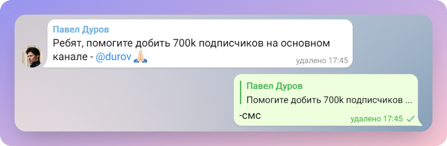  

🛈 В действительности сообщения будут удалены. На картинке они помечены как «**удалено**»  

Из-за лимитов Telegram чистка может занять до 20 минут, так как Ирису требуется время, чтобы обработать объёмные ссылки. Возможно, потребуется написать команду несколько раз.  

> Каждый исключённый участник сможет самостоятельно вернуться в чат с помощью ссылки-приглашения или публичной ссылки через некоторое время после чистки.  

### Кик неактив  

**・Кик неактив {период}** — исключает пользователей из чата, которые не проявили актив за указанный период.
_Минимальный период:_ 24 часа
**・Кик неактив \[число\]** — исключает определенное число самых неактивных участников.  

> **Пример 1:** Кик неактив 2 месяца
> **Пример 2:** Кик неактив 10  
> Если количество участников в вашем чате превышает **50**, то системное сообщение об исключении отображаться не будет. Используйте команду «+выходы».  

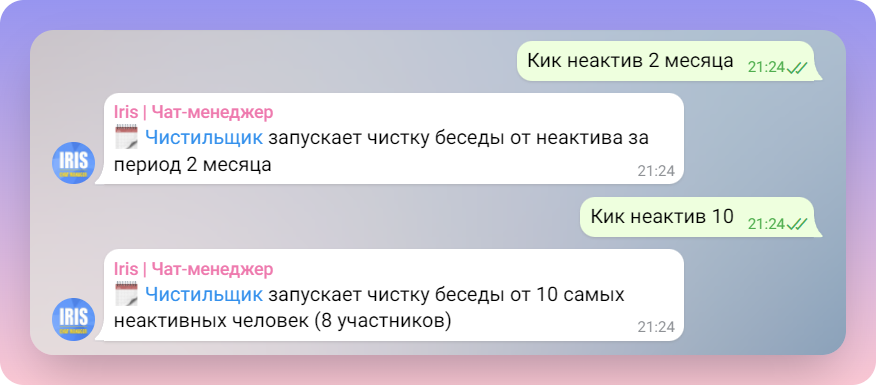  

### Кик актив  

**・Кик актив** — исключает пользователей, проявивших актив за определённое время (не более 10 минут). Функция полезна при рейдах.  

> **Пример:** !кик актив 1 минута  

### Кик новичков  

**・Кик новичков {период}** — исключает новых пользователей, которые впервые появились в чате в указанный период. Функция полезна при рейдах.  

> **Пример:** Кик новичков 1 час  

### Другие команды чистки  

**・Кик молчунов \[дней\]** — исключает тех, кто состоит в чате дольше, чем _\[дней\]_ и не написал ни одного сообщения.
**・Кик по смс {число сообщений} {период}** — участники с количеством _{число сообщений}_ сообщений меньше указанного _{период}_ будут исключены из чата.
По умолчанию параметр _{период}_ имеет значение **неделя**.
_— Синоним: кик по сообщениям_  

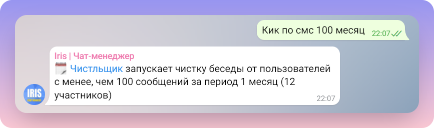  

> **Ограничить удаление сообщений:** дк -смс (ранг)
> **Ограничить кик неактив:** дк кик неактив (ранг)
> **Ограничить кик актив:** дк кик актив (ранг)
> **Ограничить кик новичков:** дк кик новичков (ранг)
> **Ограничить кик по смс:** дк кик по смс (ранг)
> **Ограничить кик от участника:** дк кик от (ранг)
> **Ограничить кик молчунов:** дк кик молчунов (ранг)
> **Ограничить кто репостил:** дк кто репостил (ранг)
> **Ограничить список неактив:** дк неактив (ранг)
> **Ограничить список молчунов:** дк молчуны (ранг)
> **Ограничить список по смс:** дк по смс (ранг)  

**[Вернуться к оглавлению](#начало)**  

## 6. Настройка чата  

### Смена закреплённого сообщения  

・ **!Закреп** **_(в ответ на сообщение)_** — закрепит указанное сообщение в чате.
・ **!Закреп {ID сообщения}** — закрепит указанное сообщение в чате. Чтобы узнать ID сообщения, введите команду «**Смс ид**» в ответ на это сообщение.
_— Синонимы: !пин, !pin_  

・ **!Открепить** — открепит закреплённое сообщение в чате.
_— Синонимы: !анпин, !unpin_  

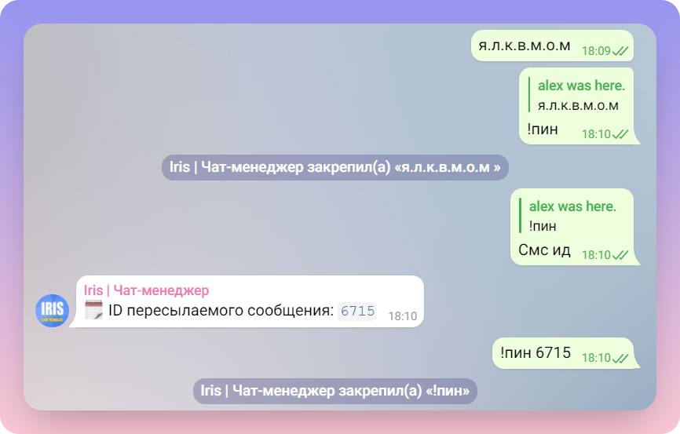  

> **Ограничить команду для смены закрепа:** дк закреп {ранг}  

### Смена названия чата  

・**!Название \[название чата\]** — изменит название чата на текст, который вы указали в \[ \].  

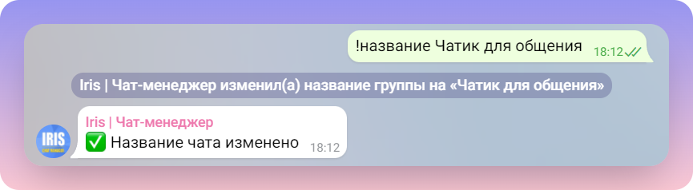  

### Чат-ссылка  

**・Чат-ссылка {ссылка}** — устанавливает ссылку на чат.
_— Синоним: /link, чатссылка_ **・ Чат-ссылка** — выводит ссылку на чат.  

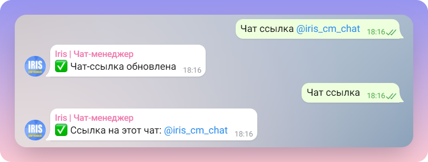  

### Правила и приветствие  

Установка правил:  

+Правила  
Текст на новой строчке  

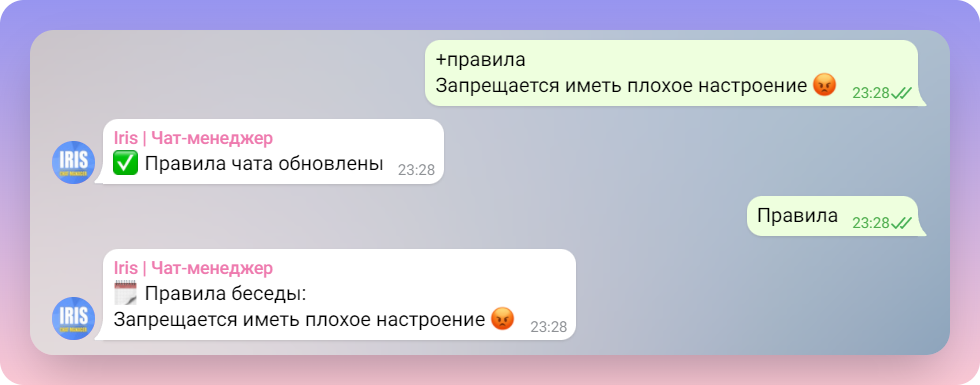  

Установка приветствия:  

+Приветствие  
Текст на новой строчке  

> В приветствии можно использовать переменные**:** • **{имя}** — выведет имя и фамилию пользователя.
> • **{ж|м|мн}** — выводит текст для: женского пола, мужского пола и нескольких людей.  

### Подробнее об установке правил и приветствия — <https://teletype.in/@iris_cm/greeting>  

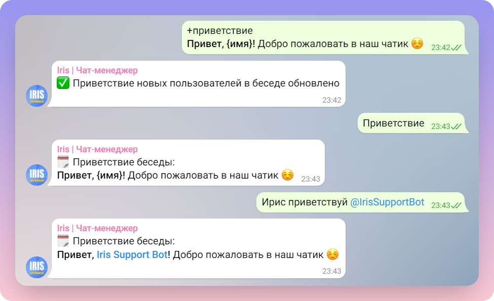  

### Автокик  

**・+Автокик** — разрешает боту удалять участника после его выхода с чата.  

> Автокику так же можно задать параметры**: автокик {число} {время} {кик или бан} ・{число}** — количество выходов из чата
> **・{время}** — количество времени, в котором участник выходит из чата
> **・{кик или бан}** — исход наказания на выбор
> Например: **автокик 3 60 бан**  

**・+Автокик молчунов {срок}** — устанавливает автокик копилок, если они в **{срок}** не напишут ни одного сообщения.
**・-Автокик** — убирает «автокик на выход».
**・-Автокик молчунов** — убирает автокик молчунов.  

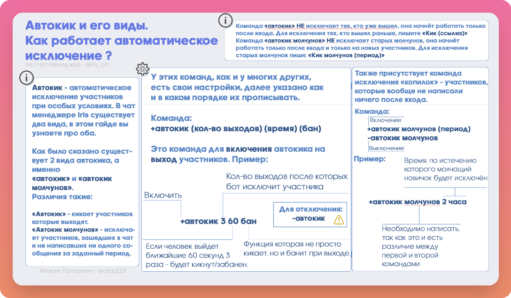  

### Отключение и включение чата  

Вы можете отключить чат — писать смогут только администраторы чата. Обычные участники вместо строки ввода увидят надпись «В этой группе запрещено писать сообщения».  

**・+Чат** / **\-Чат** — разрешить / запретить писать сообщения обычным участникам.  

> Ирис запоминает и восстанавливает настройки разрешений, которые были до момента закрытия чата. Команда также доступна через личные сообщения бота.  

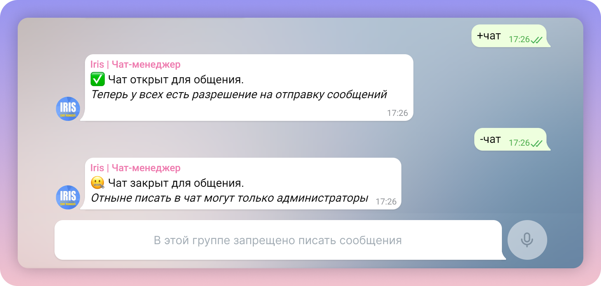  

### Настройка ТГ-администраторов чата  

**・+Тг админ \[должность\] {ссылка/ответ на смс}** — назначает участника чата администратором чата с должностью _\[должность\]_.  

Для корректного отображения должности рекомендуем использовать команду **в ответ на сообщение**!  

**После назначением администратора, участник получает следующие права:**  

- Право на блокировку и добавление участников  
- Право на удаление и закрепление сообщений  

> Учтите, чтобы команда сработала, Ирис должен иметь право на добавление администраторов и вышеперечисленные права.  

**・-Тг админ {ссылка}** — снимает статус администратора чата с участника.  

Ирис не сможет снять права администратора с участника, если его назначил другой администратор  

**Возможные ошибки:**  

- RIGHT\_FORBIDDEN — у Ириса недостаточно прав. Простое решение: включите все права у Ириса.  
- CHAT\_ADMIN\_REQUIRED — у Ириса нет прав администратора или этого участника назначал другой администратор — Ирис не сможет изменить его права.  
- BOT\_CHANNELS\_NA — Ирис не может отредактировать права указанного пользователя, скорее всего его назначил / ограничил другой администратор.  

> В чате может быть не больше 50 администраторов.  

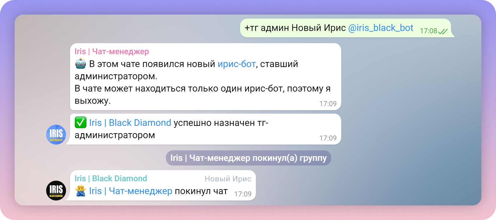  

Вы также можете назначить пользователя Telegram-администратором сразу в нескольких чатах, если они связаны сеткой чатов:  

**・Сетка +тг админ \[должность\] {ссылка}** — назначает участника чата администратором чата во всех привязанных чатах с должностью _\[должность\]_.  

Для корректного отображения должности рекомендуем использовать команду **в ответ на сообщение**!  

**・Сетка -тг админ {ссылка}** — снимает статус администратора чата со всех привязанных чатов.  

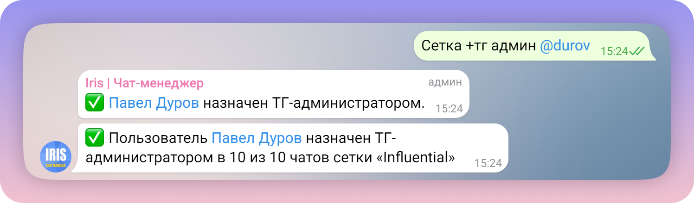  

### Ограничение отправки сообщений через каналы  

В связи с большим количеством спама от имени каналов, Telegram ограничил отправку через них и оставил возможность отправлять только подписчикам Telegram Premium — 12.10.2022.  

**・+Каналы / -Каналы** — разрешает / запрещает писать от имени каналов.  

> При запрете, Ирис будет удалять сообщение от имени канала и блокировать его. Владелец больше не сможет писать от имени своих каналов в конкретном чате.  

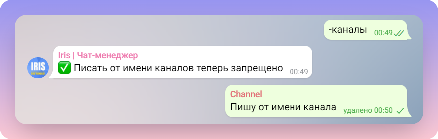  

### Системные уведомления о входах и выходах  

В больших чатах перестают появляться некоторые системные уведомления от Telegram: с 50 участников — уведомления о выходах, с 10.000 — о входах. С помощью Ириса вы можете их вернуть:  

**・+Входы** / **\-Входы** — включить / отключить уведомления о входах в чат.
**・+Выходы** / **\-Выходы** — включить / отключить уведомления о выходах из чата.  

> Или всё вместе: +входы-выходы / -входы-выходы  

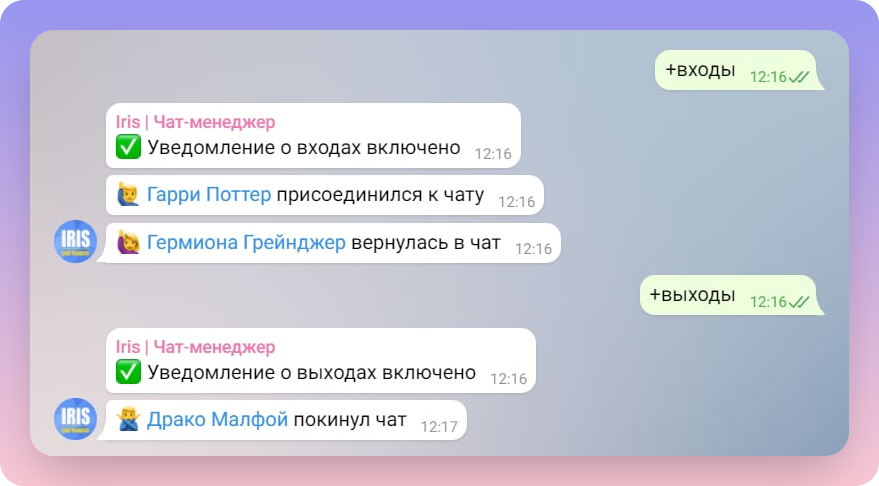  

### Минимальная регистрация  

Вы можете установить минимальный срок нахождения аккаунта во вселенной Ириса, чтобы обезопасить чат от подозрительно новых аккаунтов. Учтите, что регистрация отсчитывается с момента первого взаимодействия пользователя с ботом, а не с момента появления аккаунта в Telegram.
**・+минрег {число дней}** — установить минимальный срок регистрации для новых участников.
**・-минрег** — выключить фильтр новых участников по минимальной регистрации.
**・минрег** — показать актуальную информацию о настройках фильтра в чате.  

### Заявки на вступление  

Если у вас в чате подключены заявки на вступление, то вы сможете автоматизировать процесс принятие заявок с помощью Ириса.  

**・+Автозаявки** — включить автозаявки.
**・-Автозаявки** — отключить автозаявки.  

> [Инструкция как это включить в своём чате](https://t.me/irissup/161)  

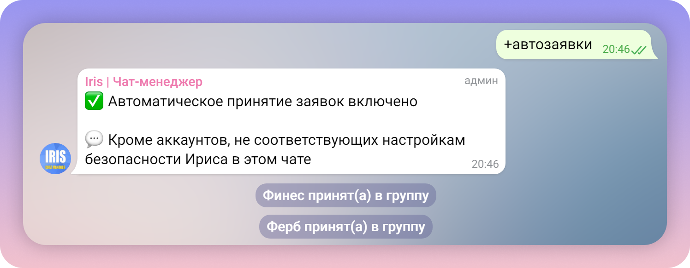  

Ирис будет принимать все заявки, кроме тех, пользователи которых состоят в «[**Ирис-антиспам**](#ирис-антиспам)» (при этом антиспам-база должна быть подключена).  

Такие пользователи будут временно заблокированы и оповещены об отклонении заявки в личные сообщения бота:  

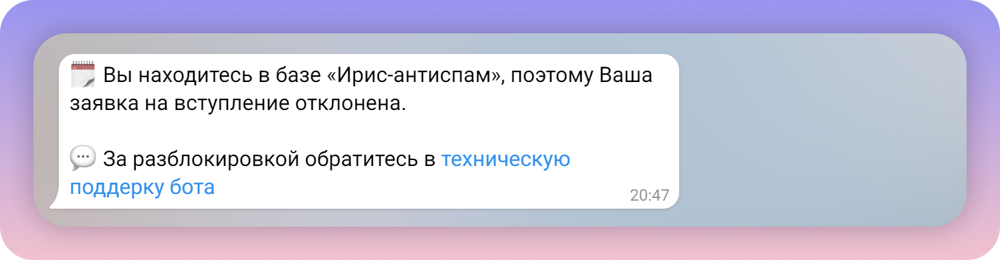  

### Проверка в чате  

**・Проверить в чате** — проверяет анкеты на присутствие в чате. Полезно, когда Ирис говорит, что такого пользователя нет в чате:  

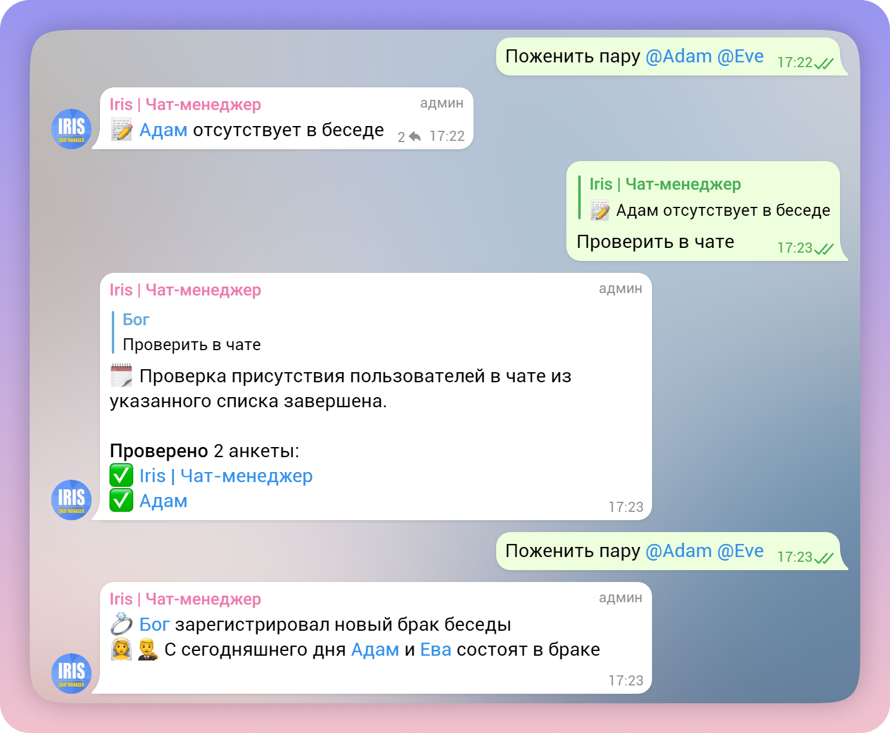  

А ещё команда помогает убирать вышедших участников из статистики и списка неактив, если они по какой-то причине там остались — достаточно использовать команду на сообщение, содержащие список...  

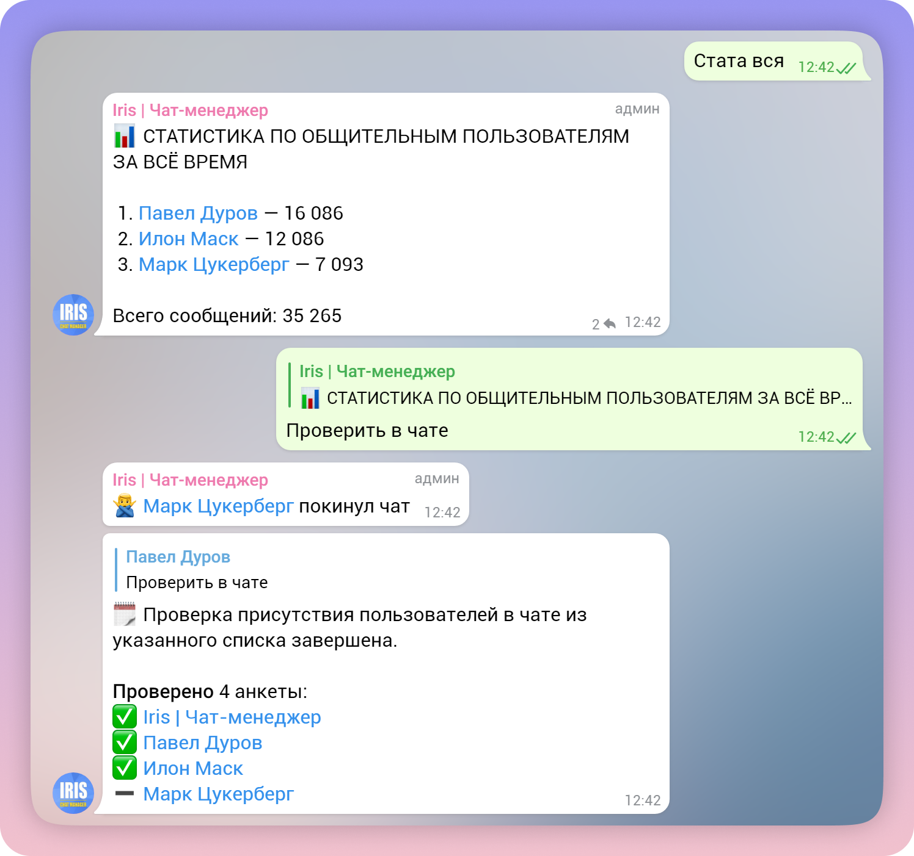  

...и получись очищенный список:  

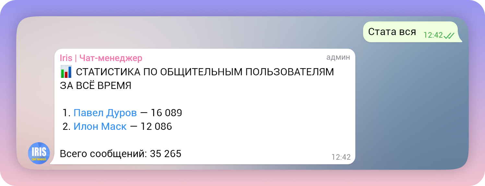  

Альтернативное использование:  

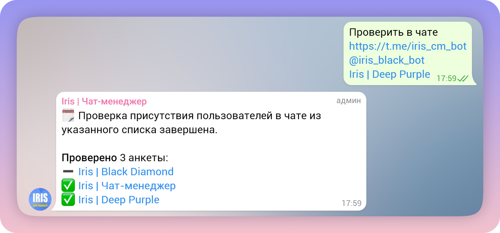  

### Другие команды настройки чата  

**・+Инлайны / -Инлайны** — включает / выключает текстовые оповещения о нажатиях инлайн-кнопок.  

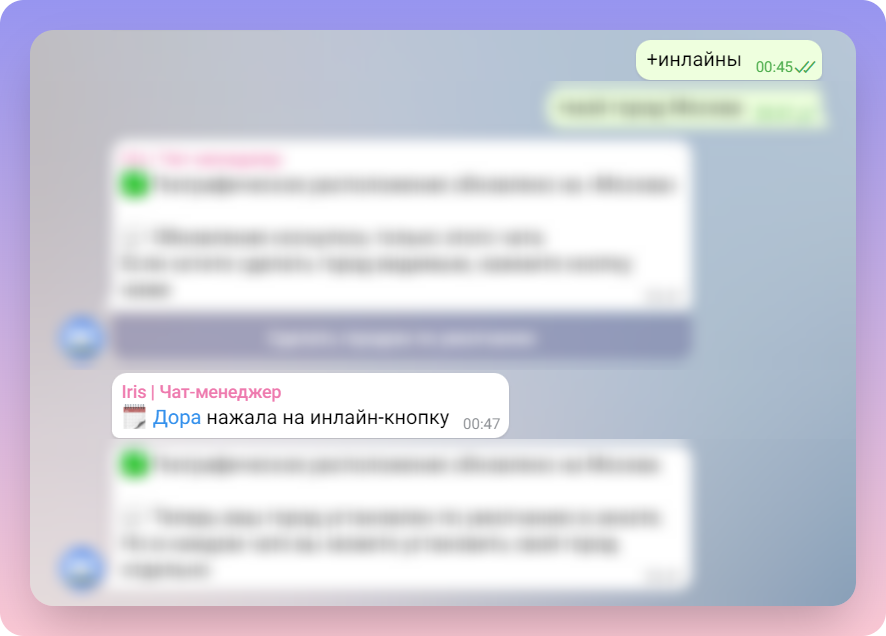  

* * *

**・Обновить чат** — обновляет информацию о чате (кол-ва участников и т.п.). Команда также обновляет информацию о действующем создателе. Если у вас в чате поменялся создатель, обязательно воспользуйтесь этой командой.  

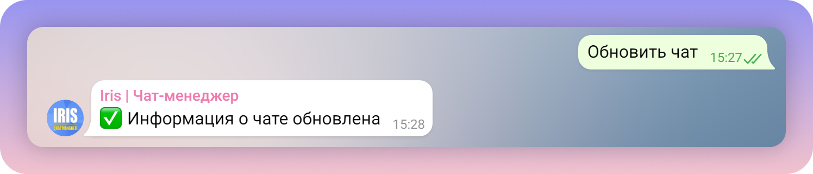  

**・Код чата** — покажет персональный код чата. Используется для привязки чата, для переезда и для использования команд через личные сообщения.
_— Синоним: код беседы_  

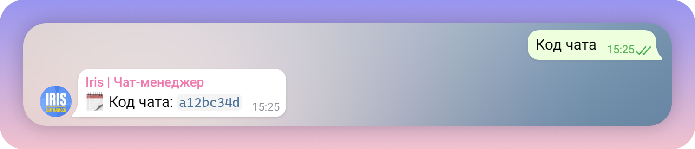  

**・!Привязать** — привязывает чат к [личным сообщениям Ириса](https://t.me/iris_cm_bot).
Альтернатива в ЛС Ириса:
**・!Привязать {код чата}** — привязывает личные сообщения Ириса к чату с указанным кодом.  

В л/с Ириса вам станут доступны следующие команды: _чат инфо, дк, мдк, команда {команда} {ранг}, бан/кик {ссылка}, кто ты {ссылка}, кто я, -смс_, _общий сбор_, _кик молчунов, кик актив, кик новичков, мрп_, а также применять действия в отношениях.  

**・Импорт команд из {код чата}** — копирует «доступ команд» из чата, чей код взяли — в вашу. При этом, вы должны являться 5 рангом в своем чате и иметь доступ к _«доступ команд»_ в чате, откуда переносите.  

  

**・Смс ид** — показывает ID сообщения в чате (использовать ответом на сообщение).
**・Перейти к смс (ид)** — выдаёт прямую ссылку на переход к смс (ид) в чате.  

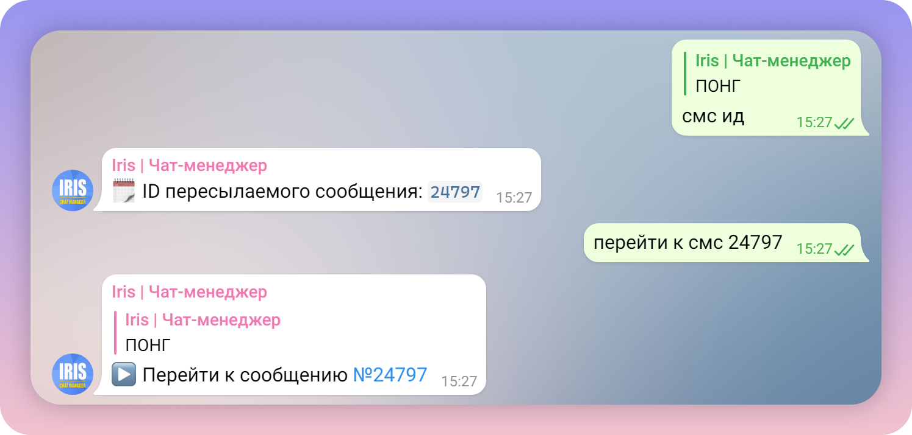  

### Команды настройки безопасности  

**・Инвайты {число}** — ограничивает число одновременно добавляемых пользователей. После достижения ограничительного числа пользователь исключается из чата. Если {число} указано в 0, то ограничение на приглашения снимается.
**・Антирейд {число}** — ограничивает количество попыток приглашений забаненного пользователя. В случае, если кто-то пригласил забаненного пользователя более _{число}_ раз, этот приглашавший также будет добавлен в бан-лист.
**・+Антирейд** — ограничивает количество попыток приглашений забаненного пользователя до 1. После первого же добавления забаненного пользователя, пригласивший отправляется в бан.
_— Синоним: +чп_ **・-Антирейд** — при добавлении забаненного участника, приглашающего не будет банить.
_— Синонимы: -чп, антирейд 0_  

### Ограничение на использование ссылок  

**・+Беседы** / **-Беседы** — разрешает / запрещает отправлять сообщения содержащие ссылки на частные чаты.
**・+Сайты** / **-Сайты** — разрешает / запрещает отправлять сообщения содержащие ссылки на сторонние сайты.
**・+Теги** / **\-Теги** — разрешает / запрещает отправлять сообщения содержащие ссылки на ресурсы Телеграм.
**・+Боты** / **-Боты** — разрешает / запрещает приглашать ботов в чат.  

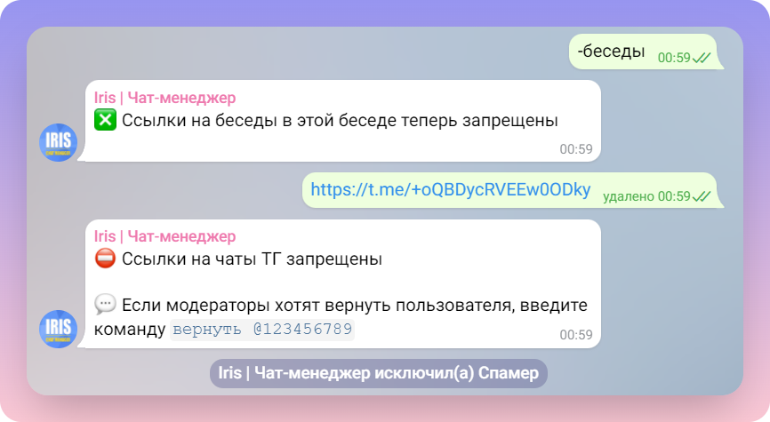  

**・Ссылки срок={число дней}** — снятие ограничения на использование -**беседы** / **-группы** / **-сайты** / **-боты** по исходу пребывания участника {число дней} в беседе. **・Ссылки рейтинг={число}** — снятие ограничения на использование **\-беседы / -группы** / **-сайты** / **-боты** по достижении участника {число} репутации в беседе.  

> **Ограничить команду для смены закрепа:** дк закреп {ранг}
> **Ограничить команду для смены названия беседы:** дк унб {ранг}
> **Ограничить доступность смены настроек беседы:** дк унб (ранг)
> **Ограничить установку правил:** дк установка правил (ранг)
> **Ограничить вызов правил:** дк вызов правил (ранг)
> **Ограничить установку приветствия:** дк установка приветствия (ранг)
> **Ограничить вызов приветствия:** дк вызов приветствия (ранг)
> **Ограничить установку чат-ссылки:** дк установка чатссылки (ранг)
> **Ограничить вызов чат-ссылки:** дк вызов чатссылки (ранг)
> **Ограничить помощь:** дк помощь (ранг)
> **Ограничить упоминания:** дк унб (ранг)  

**[Вернуться к оглавлению](#начало)**  

## 7. Настройка сетки чатов  

> Полезный раздел, если у вас есть несколько своих чатов и вам нужно управлять ими с помощью одной команды.  

Вы можете связывать свои чаты в единую сетку чатов и использовать дополнительные команды, которые будут срабатывать на все чаты сразу.  

После привязки всех чатов в единую сетку, вы можете вызывать список смежных чатов командой _«_**Чаты**_»_ и получить общую информацию о них: название, описание и ссылку на чат (если она указана)_._  

### Команды  

**・Чаты** — выведет список групп смежных чатов.  

**・+Глмодер {ссылка}** / **-Глмодер {ссылка}** — назначает модератором / снимает модератора в сети. Выдать может гладмин или создатель сетки.
**・+Гладмин {ссылка}** / **-Гладмин {ссылка}** — назначает админом / снимает админа в сети. Выдать может только владелец сетки.  

**・Сетка модеры** — выведет список глобальных модераторов сетки.
**・Сетка !модер** — назначает модератором данного ранга в каждой из чатов в сетке. Количество «!» означает номер ранга модерации.  

**・Глобан {ссылка}** — заблокирует пользователя во всей сети.
**・Глоразбан {ссылка}** — снимет бан с пользователя во всех привязанных чатах. Пользователь сможет вернуться самостоятельно по ссылке-приглашению.  

**・Сетка баны** — покажет список пользователей, забаненных в сетке.
**・Сетка кик {ссылка}** — исключит пользователя из всей сети.  

**・Сетка снимаю полномочия** — снимает с вас полномочия в самой сетке, но не в ее беседах .
**・Сетка восстановить создателя** — возвращает вам права создателя сетки, если вы их сняли самостоятельно или вам передали права создателя.
**・Сетка передать создателя {ссылка}** — передает права создателя сетки.  

### Подробнее об установке и других командах — <https://teletype.in/@iris_cm/grid>  

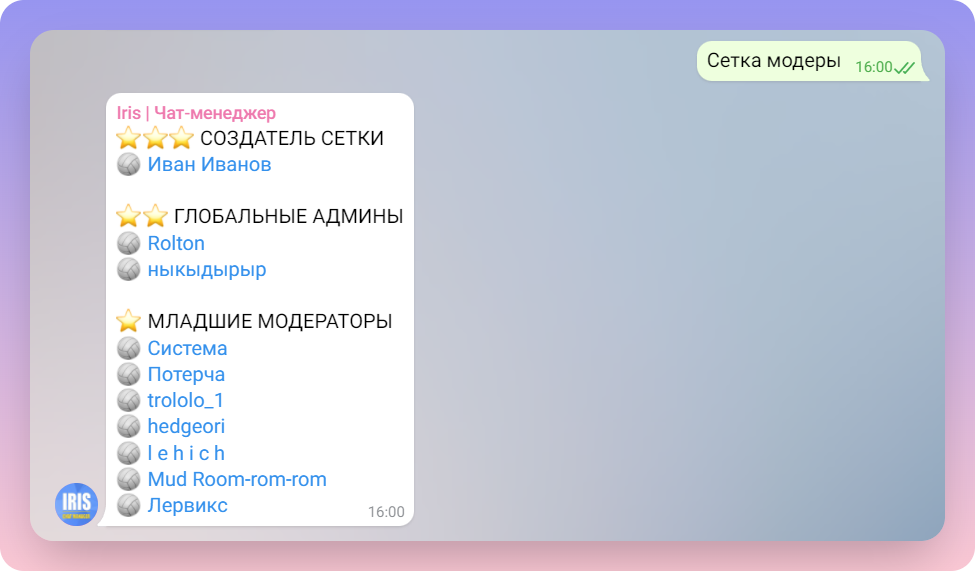  

> **Ограничить установку сетки:** дк установить сетку (ранг)
> **Ограничить вывод сетки в чате:** дк чаты (ранг)  

**[Вернуться к оглавлению](#начало)**  

## 8. Анкета пользователя  

> **Анкета пользователя** — общая информация об участнике внутри чата. Некая карточка пользователя. Чтобы просмотреть карточку во вселенной Ириса, введите команду «**Профиль**» в личных сообщениях Ириса.  

### Анкета  

**・Моя анкета** — выводит информацию вашей анкеты.
**・Анкета {ссылка}** — выводит анкету указанного пользователя.
**・+Анкета / -Анкета** — включает / выключает видимость вашей анкеты.  

**・Мой пол {м|ж|др}** — устанавливает ваш пол.
**・-Мой пол** — удаляет пол из вашей анкеты.  

**・!Мой город {название}** — установит город в вашу анкету.
**・-Мой город** — удаляет город из вашей анкеты.  

**・Мой др {дд.мм.гг} \[всё/месяц/год\]** — установит вашу дату рождения. В квадратных скобках указана настройка видимости вашего др в анкете.
**・-Мой др** — удаляет вашу дату рождения из анкеты.  

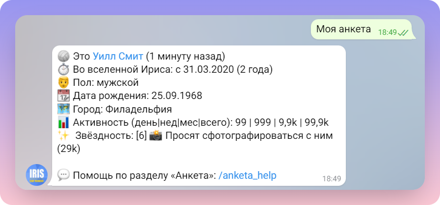  

### Карточка пользователя  

**・ Кто я** — выводит информацию о пользователе, вызвавшем команду.
_— Синонимы: !роль, профиль, хто я_ **・ Кто ты {ссылка}** — выводит информацию об указанном пользователе.
_— Синоним: Профиль {ссылка}_ **・Моя стата** — выводит информацию о пользователе в виде графика.  

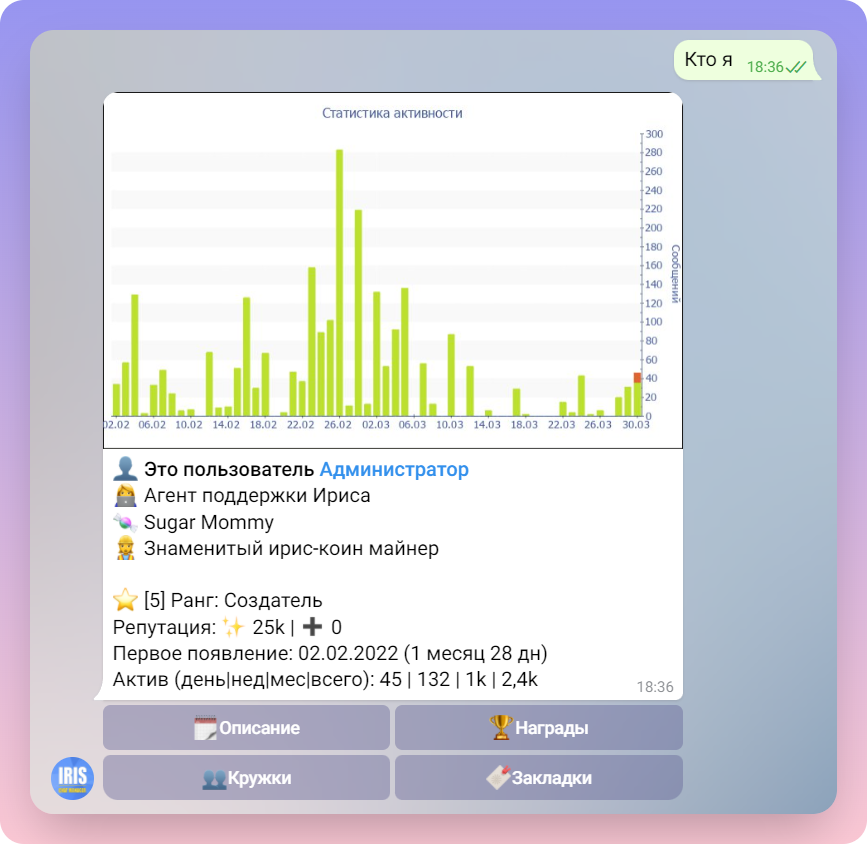  

### Описание  

**・ О себе \[enter\]** — в следующей строке указывайте полную информацию о себе. Можно в несколько строк. Чтобы удалить: **\-о себе** _— Синоним: Описание {enter}_ **・ Описание {ссылка}** — выводит полное описание пользователя.  

**🎩・!Назначить описание {ссылка}** — установит описание
указанному участнику. Описание указывается на следующей строке.
**🎩・!Удалить описание {ссылка}** — удалит описание указанного пользователя.  

> Ограничение в 3800 символов.  

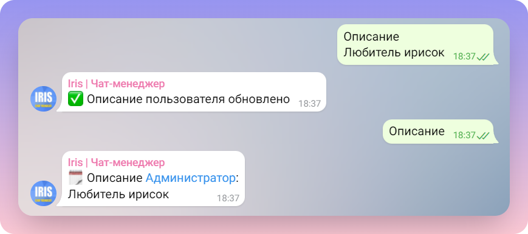  

### Никнейм  

**・+Ник {текст}** — устанавливает ник в конкретном чате.
_— Синоним: !ник_ **・Ник / Ник {ссылка}** — покажет ник пользователя.
**・Ник удалить** — удаляет ваш ник в конкретном чате.
_— Синоним: -ник_  

**🎩・!Назначить ник {ник} {ссылка}** — установит никнейм
указанному участнику.
**🎩・!Удалить ник {ссылка}** — удалит никнейм указанного пользователя.  

> Ограничение в 30 символов.  

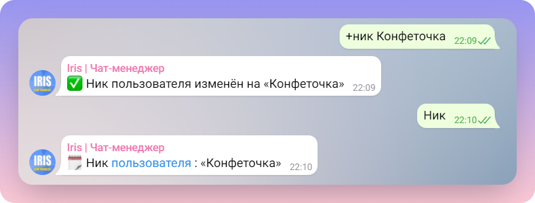  

### Звание  

**・+Звание {текст}** —устанавливает звание в конкретном чате. Выводится в первой строчке после имени/ника.
_— Синоним: !звание_ **・Звание / Звание {ссылка}** — покажет звание пользователя.
**・Звание удалить** — удаляет ваше звание в конкретном чате.
_— Синоним: -звание_  

**🎩・!Назначить звание {ник} {ссылка}** — установит звание
указанному участнику.
**🎩・!Удалить звание {ссылка}** — удалит звание указанного пользователя.  

> Ограничение в 30 символов.  

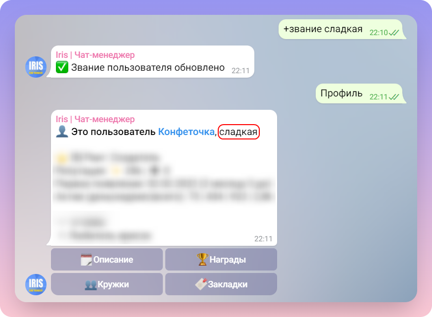  

### Девиз  

**・+Девиз {текст}** — устанавливает девиз для рейтингов (например, «**Штоп**»).
**・**\-**Девиз** — удаляет девиз для рейтингов.
**・**!**Девиз** — просмотр своего девиза.  

> Ограничение в 100 символов.  

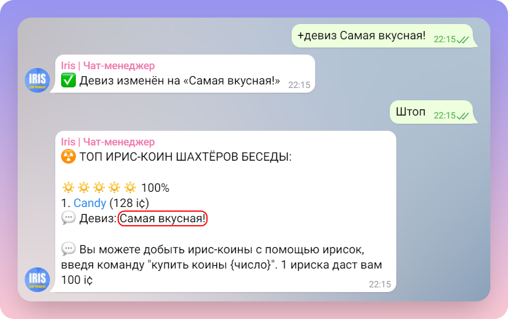  

### Гражданство  

**・ +Гражданство** — устанавливает гражданство в данном чате.
**・ Все граждане** — список граждан чата.
_— Синоним: кто гражданин, кто граждане_  

> Гражданство просто помечает, что вы гражданин какого-то чата. В статистике рядом с вашем именем будет отображаться значок «🏡».  

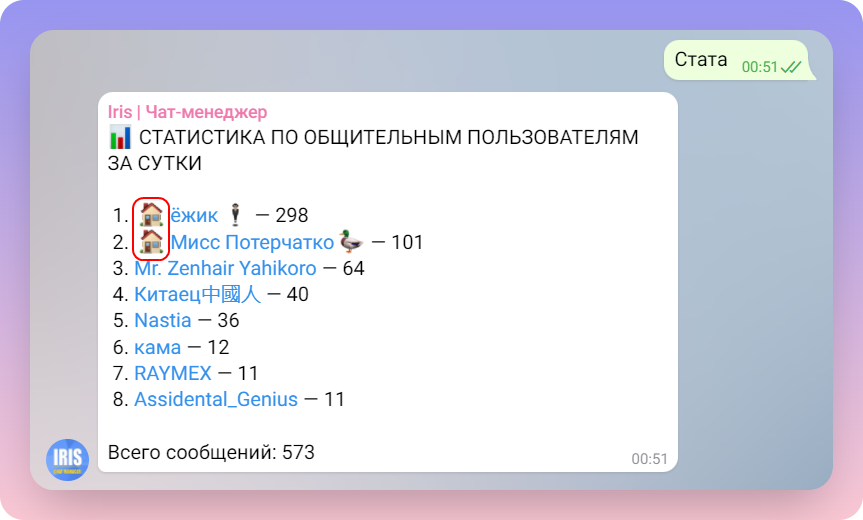  

### Ачивки  

**・Мои ачивки** — покажет список ваших ачивок + общую статистику во вселенной Ириса.
**・+Ачивки** / **-Ачивки** — откроет / скроет просмотр ваших ачивок от посторонних глаз (если открыть, то список ваших ачивок будет показан прямо в профиле).
**・Твои ачивки** — покажет список ачивок выбранного пользователя (если он разрешил их просматривать другим пользователям).
_— Синоним: покажи ачивки_  

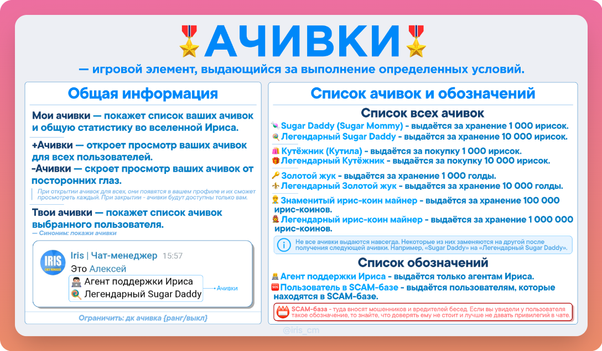  

### Подписки  

**・+/-Подписка** — создает/отменяет подписку на данного человека и тот, на кого вы подписаны, может вызвать вас командой «**Позвать своих**»_. **・**_ **Все сабы** — показывает список самых популярных инфлюенсеров Вселенной Ириса.
**・Сабы чата** — показывает список самых популярных инфлюенсеров чата.  

**・Мои подписки** — список людей, на которых Вы подписаны.
**・Мои сабы** — список людей, подписанных на вас
**・Подписки {ссылка}** — список подписанных на пользователя людей.  

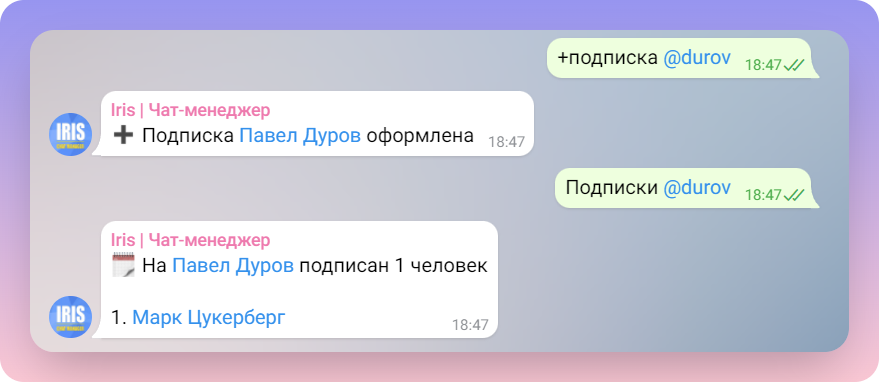  

### Другое  

**・ Награды {ссылка}** — выводит список наград пользователя.
**・ !Регистрация {ссылка}** — выводит дату регистрации во вселенной Ириса.
_— Синоним: !рег {ссылка}_ **・!Ид {ссылка}** — выводит цифренный ID пользователя, канала, бота и анонимного администратора.
_— Синоним: !id_  

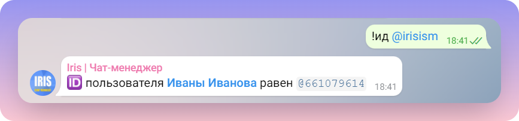  

> **Ограничить профиль:** дк профиль (ранг)
> **Ограничить анкету:** дк анкета (ранг)
> **Ограничить установку ника:** дк установить ник (ранг)
> **Ограничить список ников:** дк ники (ранг)
> **Ограничить показ ника:** дк показать ник (ранг)
> **Ограничить показ своего ника:** дк показать свой ник (ранг)
> **Ограничить установку звания:** дк установить звание (ранг)
> **Ограничить вызов звания:** дк вызвать звание (ранг)
> **Ограничить описание (о себе):** дк установить описание (ранг)
> **Ограничить вызов описания:** дк вызвать описание (ранг)
> **Ограничить список подписчиков:** дк подписчики пользователя (ранг)
> **Ограничить гражданство:** дк гражданство (ранг)
> **Ограничить кто добавил (кто назначил):** дк кто добавил (ранг)
> **Ограничить регистрацию:** дк рег (ранг)
> **Ограничить ид пользователя:** дк ид (ранг)
> **Ограничить девиз:** дк девиз (ранг)  

**[Вернуться к оглавлению](#начало)**  

## 9. Статистическая информация  

### Актив Ириса  

・**!Актив Ириса** — покажет статистику всех ботов семейства Ирис.  

💚 - хороший показатель
💛 - показатель барахлит
💔 - показатель плохого состояния  

> Сердечки в \[ \] — это "морозы" от Telegram (они в основном есть у всех недавно-созданных ботов). Очередь — это через сколько бот примерно ответит.  

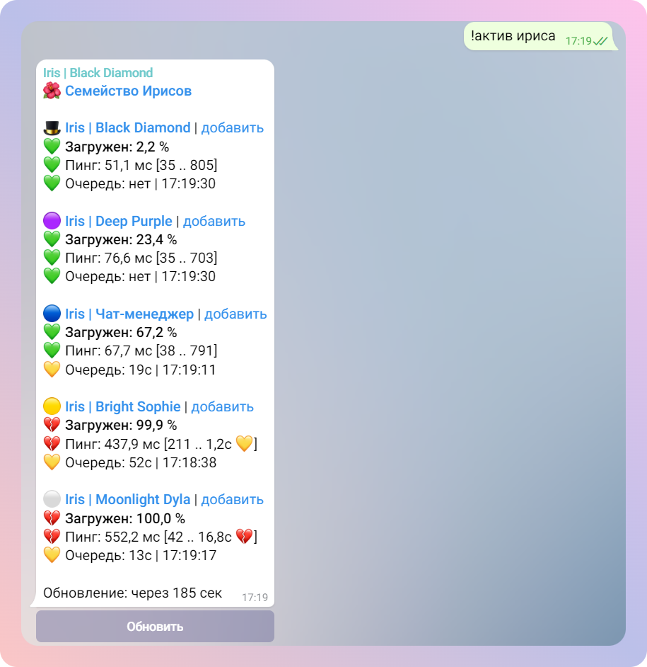  

### Включение / отключение графика  

・**+Стата** / **\-Стата** — включение / выключение показа графика активности в командах «**Чат инфо**» и «**Профиль**».  

🟢 — статистика за сегодня (начиная с 00:00 по МСК)
🔴 + 🟢 — статистика за последние 24 часа  

  

🟢 — статистика за сегодня (начиная с 00:00 по МСК) | 🔴 + 🟢 — статистика за последние 24 часа  

### Статистика чата  

・**Чат инфо** — выведет общую информацию чата.
・**Чат стата** — выведет общую информацию чата в виде картинки.  

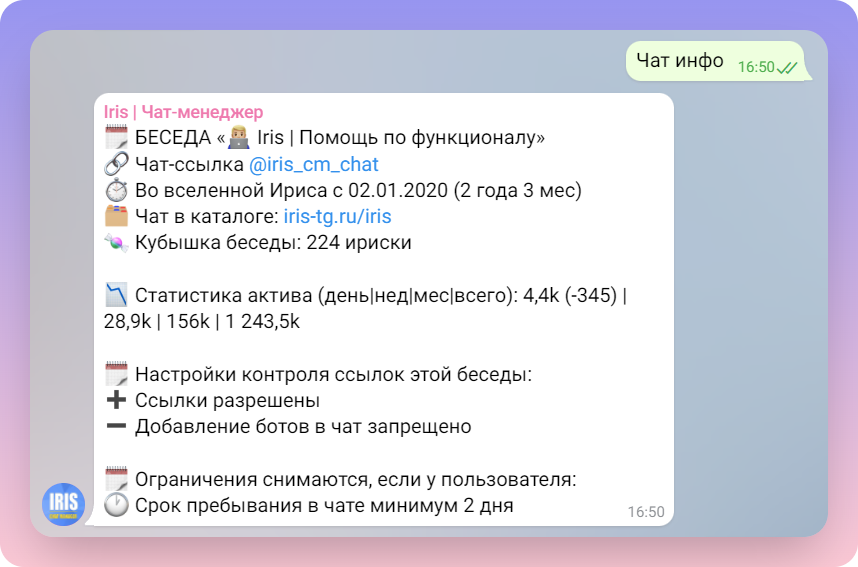  

### Статистика о пользователе  

・**Моя стата** — выведет активность пользователя в чате в виде графика.  

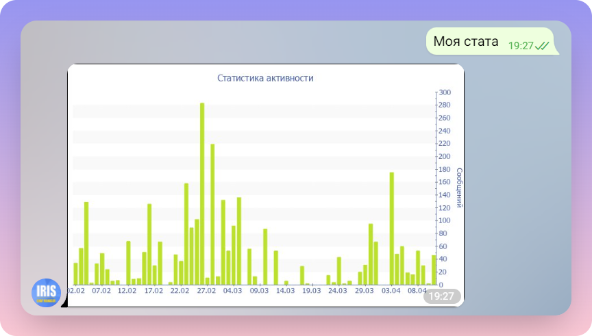  

### Статистика сообщений  

・**Стата сутки** — статистика сообщений за 24 часа.
_— Синоним: Стата, Топ, Топ сутки_ ・**Стата неделя** — статистика сообщений за 1 неделю.
_— Синоним: Топ неделя_ ・**Стата месяц** — статистика сообщений за 1 месяц.
_— Синоним: Топ месяц_ ・**Стата вся** — статистика сообщений за всё время.
_— Синоним: Топ вся_  

> Если вы хотите вывести определённое количество участников, то укажите цифру после команды «Стата» или «Топ» (до 100). Например:
> **・Топ 10 неделя** — топ 10 активных пользователей за неделю.
> **・Стата 1 вся** — самый активный пользователь за всё время и т.п.  

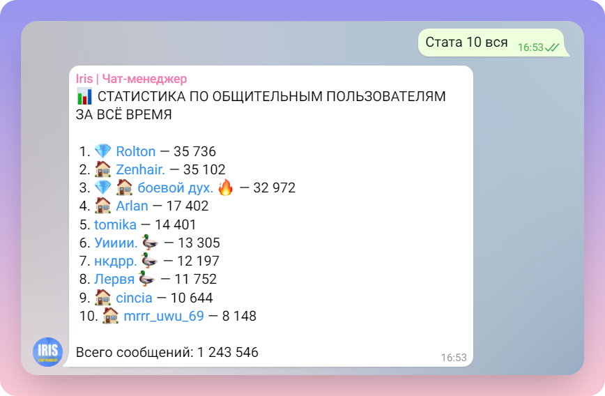  

### Статистика вложений ирис-коинов  

・**Бтоп стата** — покажет историю вложений ирис-коинов в чат.  

・**Бкоин {число}** — зачислит _{число}_ ирис-коинов в баланс чата с вашего мешка.  

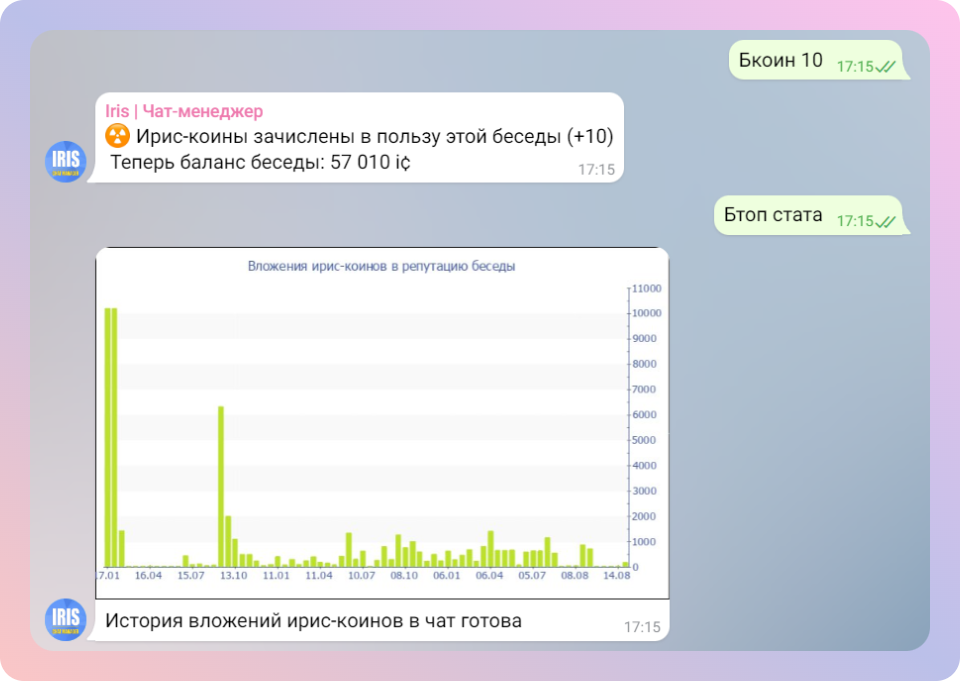  

### Другие команды статистики  

・**Олды** — список самых старых пользователей чата, которые проявляли актив за последний месяц.
・**Новички** — список недавно вступивших в чат пользователей.  

・**Кто онлайн** — список пользователей чата, кто сейчас онлайн.
_— Синоним: Кто в сети_ ・**Кто граждане** — список всех граждан чата.
_— Синоним: Кто гражданин_  

・**Кто вип** — показывает пользователей чата с **VIP-статусом**.
・**Кто не вип** — показывает пользователей чата без **VIP-статусом**.

・**Ники** — покажет список всех никнеймов чата.
・**Ники {номер страницы}** — откроет сразу нужную страницу списка ников.
・**!Сброс ников**— сбросит все никнеймы пользователей.  

・**!Население** — показывает сбор статистики количества участников чата.
・**Мои баны / Мой спам** — выдаёт информацию по банам, выданным во всех чатах пользователя (**[вводить в л/с бота](https://t.me/iris_cm_bot)**).
・**Кто меня добавил** — показывает, кто добавил вас в чат.
・**Кто добавил** **{ссылка}** — показывает, кто добавил указанного человека в чат.
・**Мой актив** — список чатов, в которых вы находитесь или находились недавно (**[вводить в л/с бота](https://t.me/iris_cm_bot)**). Максимум 20 чатов.  

・**Список неактив {период}** — список всех неактивный за данный период.
_— Синоним: Кто неактив {период}_ ・**Список молчунов {период}** — список всех молчунов, кто зашел ранее данного периода и не написал ни одного сообщения.
_— Синоним: Кто молчун {период}_ ・**Список по смс {кол-во} {период}** — список всех участников, не написавших _{количество}_ смс в данный _{период}._  

* * *

Ботам запрещено делать массовые уведомления, поэтому следующие команды не работают должным образом. Будет отображена только иконка «@» в чате, упоминание в шторке уведомлений не появится.  

・**Позвать молчунов** — отправит уведомление всем молчунам.
_— Синоним: созвать молчунов_
・**Позвать \[enter\] {ссылки}** — отправит уведомление выбранному(-ым) пользователю(-ям).
・**Позвать _(в ответ на сообщение)_** — отправит уведомление пользователям, которые указаны в сообщении.  

・**Созвать всех \[enter\] {текст}** — упоминает всех участников чата.
_— Синоним: Общий сбор_ ・**Созвать онлайн \[enter\] {текст}** — упоминает всех участников чата, находящихся в сети.  

> **Ограничить список онлайн:** дк онлайн (ранг)
> **Ограничить список олдов:** дк олды (ранг)
> **Ограничить список новичков:** дк новички (ранг)
> **Ограничить список кто актив:** дк актив (ранг)
> **Ограничить статистику активности:** дк стата (ранг)
> **Ограничить чат инфо:** дк чат инфо (ранг)
> **Ограничить вызов кода беседы:** дк код беседы (ранг)
> **Ограничить общий сбор:** дк общий сбор (ранг)  

**[Вернуться к оглавлению](#начало)**  

## 10. Темы модераторов  

> Если вы хотите, чтобы статусы ваших модераторов были тематическими, вы можете установить темы из предложенного списка, либо настроить свои названия.  

### Установка темы  

・**Модераторы названия** — текущие названия рангов модераторов.
・**!Темы** — список доступных тем "из коробки".
・**!Темы {номер/тема}** — установка темы "из коробки" по порядковому номеру или названию.  

Ещё больше тем модераторов вы можете найти [на этом канале](https://t.me/iris_topics)  

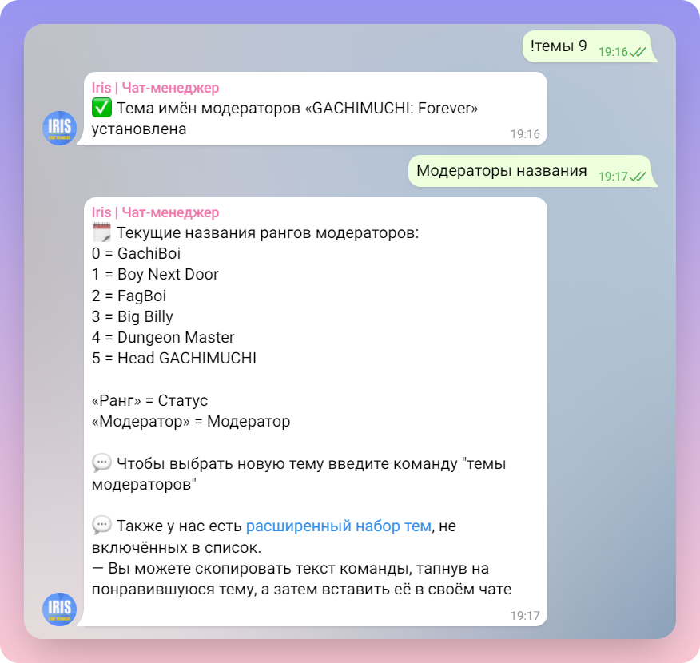  

Свои названия модераторов вы можете настроить, выполнив команду, как указано ниже:  

Модераторы названия  
0 и=участник;р=участника;д=участнику;т=участником;мн=участники  
1 и=младший модератор;р=младшего модератора;д=младшему модератору;т=младшим модератором;мн=младшие модераторы  
2 и=старший модератор;р=старшего модератора;д=старшему модератору;т=старшим модератором;мн=старшие модераторы  
3 и=администратор;р=администратора;д=администратору;т=администратором;мн=администраторы  
4 и=старший администратор;р=старшего администратора;д=старшему администратору;т=старшим администратором;мн=старшие администраторы  
5 и=создатель;р=создателя;д=создателю;т=создателем;мн=создатели  
ранг и=ранг;р=ранга;д=рангу;т=рангом;мн=ранги  
должность и=модератор;р=модератора;д=модератору;т=модератором;мн=модераторы  

> **и** — именительный, **р** — родительный, **д** — дательный, т — творительный падежи, **мн** — во множественном числе.  

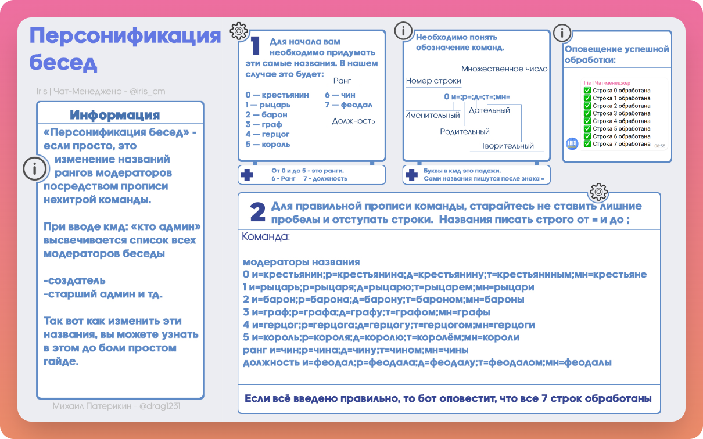  

### Установка иконки  

🎩 Чаты с Premium-статусом могут установить свою собственную иконку для команды «Кто админ», вместо стандартной ⭐️. Установить можно абсолютно любой эмодзи!  

・**+Иконка модераторов {эмодзи}** — установка своей иконки.
\-- Синоним:
・-**Иконка модераторов** — установка иконки по умолчанию (⭐️).  

Кроме того, **любой чат** может установить специальную иконку, соответствующую конкретному празднику  

・+Иконка хэллоуин — иконка 💀  

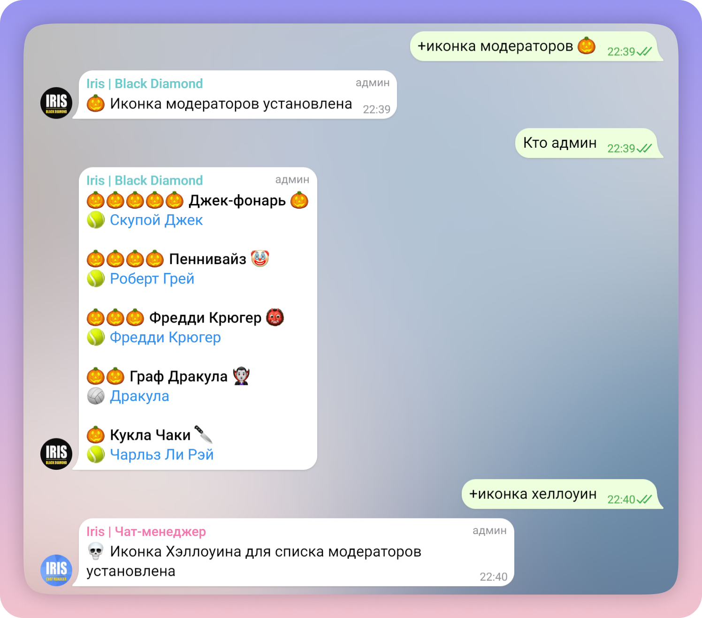  

> **Ограничить темы:** дк темы (ранг)  

**[Вернуться к оглавлению](#начало)**  

## 11. Голосование за бан  

・**Гб {ссылка}** — запускает голосование за бан пользователя (параметры по умолчанию: число голосов 5, ранг 0).
・**Гб {число голосов} {ранг} {ссылка}** — запускает голосование за бан пользователя с параметрами.
・**Гб стоп {ссылка}** — удаляет голосование за бан.
・**Гб инфо {ссылка}** — информация о процессе голосования за бан указанного участника.
・**Гб список** — список всех голосований за бан в чате за бан / против бана - голосование за / против бан.  

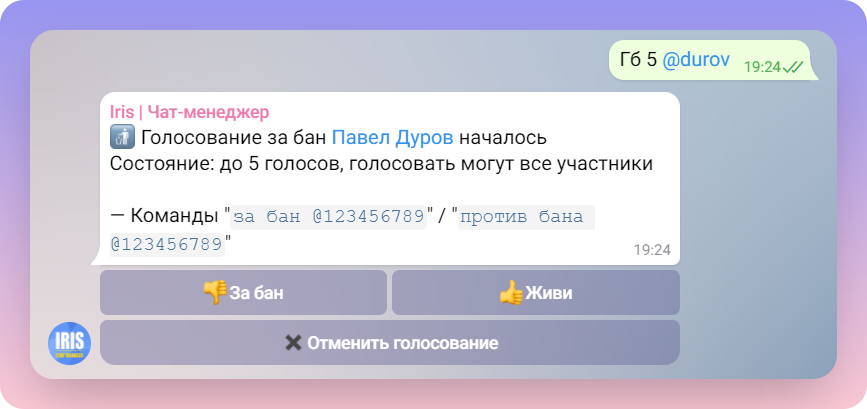  

> **Ограничить начало голосования:** дк гб начать (ранг)
> **Ограничить список на бан:** дк гб список (ранг)  

**[Вернуться к оглавлению](#начало)**  

## 12. База «Ирис-антиспам» и «SCAM»  

## Ирис-антиспам  

**Ирис-Антиспам** — это база данных всех вредителей, которых банил Ирис автоматически за ссылки на чаты, каналы или ботов.
Если пользователь находится в базе «**Ирис-Антиспам**», то Ирис попросту не пропустит его в чат, где включен этот фильтр. Таким образом спамеры, рейдеры, пиарщики не смогут нанести вред вашему чату.  

По умолчанию все чаты подключены к этой базе и банят всех вредителей при попытке вступления в чат. Но вы можете отключить этот фильтр, если вам не нравится, что ваших друзей, которые кидали ссылки в чужие чаты, банит этот фильтр:  

・**+Ирис антиспам** — включит «Ирис-Антиспам»
・**\-Ирис антиспам** — отключит «Ирис-антиспам»  

### Подробнее об «Ирис-антиспам» — <https://teletype.in/@iris_cm/spam>

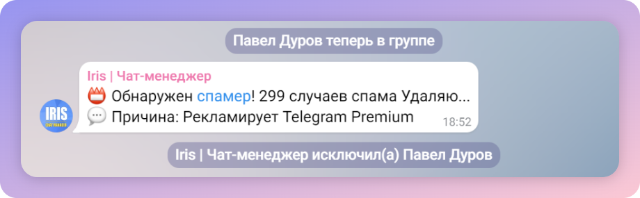  

* * *

### SCAM  

«**SCAM**» — это база данных всех злоумышленников и мошенников, которые когда-либо разрушали чьи-либо чаты путём обмана / мошенничества или обманывали пользователей на ириски или другую валюту во вселенной Ириса.  

В отличие от базы «**Ирис-Антиспам**», пользователь сможет присоединиться к чату и использовать команды бота, но с специальной пометкой (🆘) и некоторыми ограничениями в использовании функционала Ириса.  

### Подробнее о базе «SCAM» — <https://teletype.in/@iris_cm/scam>

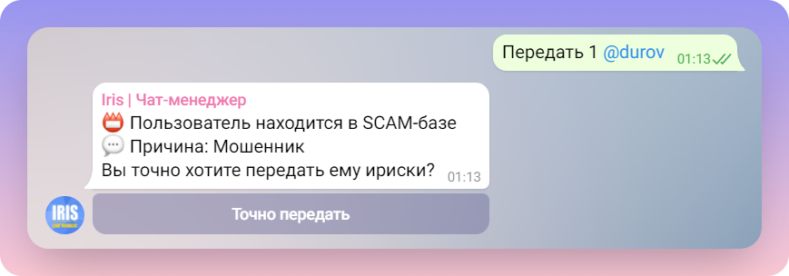  

> **Ограничить вкл и выкл ирис-антиспам базы:** дк унб (ранг)  

**[Вернуться к оглавлению](#начало)**  

## 13. Бонусы, ириски и VIP-статус  

### Список всех бонусов  

・ **Вип** — дополнительные функции для личного использования.
・ **Банхаммер** — бан участника на сутки по вашему желанию.
・ **Плюсопад** — увеличение лимита выдачи / получения плюсов.
・ **Минусит** — выдача минусов / снижение рейтинга участника.
・ **Коины** — валюта для репутации и пиара чатов, для использования в отношениях.
・ **Анонимка** — анонимная почта в чаты.
・ **Анонимка РП** — анонимная рп-команда в чаты.  

### Подробнее о всех бонусах — <https://teletype.in/@iris_cm/bonuses>  

### Ириски 🍬  

**Ириски** — это личные средства пользователя, не привязанные к конкретному чату. Их можно передавать и покупать за них бонусы. Ириски являются главной валютой во вселенной Ириса.  

В связи с последними ограничениями, покупка ирисок для вас может быть затруднительна. Обращайтесь к агентам поддержки, чтобы приобрести ириски и получить больше информации.  

・**Купить {число}** — покупка _{число}_ ирисок. Для продолжения перейдите в личные сообщения бота.
・**Передать {число} {ссылка}** — передать _{число}_ ирисок пользователю.  

> Ириски можно передавать только пользователям и в неограниченном количестве.  

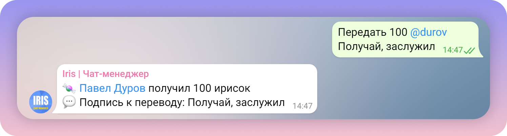  

### Чеки  

・**Создать чек {число}** — создание чека на указанную сумму ирисок.
В лс Ириса:
・**Мои чеки** — список созданных вами чеков.
・**Чек {номер или код}** — просмотр информации о выбранном чеке.
・**Отменить чек {номер или код}** — удалить выбранный чек.
・**Активировать чек {код}** — активировать полученный чек.  

> Создавать и отправлять чеки можно в личной переписке с любым пользователем. При этом информация о создании и активации чека будет дублироваться в вашу личную переписку с ботом.  

### История путешествия ирисок 🚀  

・**Где мои ириски** — история путешествия ваших ирисок за последнее время.
_— Синоним: куда пропали мои ириски, !история ирисок, !путешествие ирисок_  

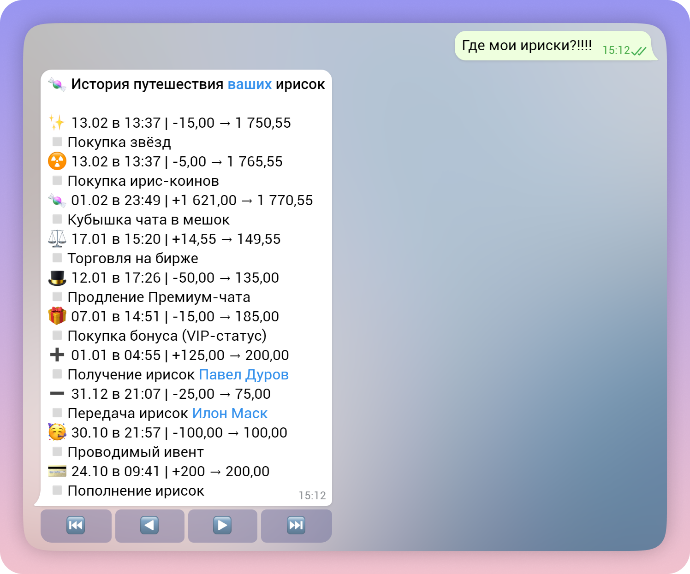  

### Порог передачи ирисок 🛑  

В одном из обновлений появились уведомления при переводе ирисок. Они появляются когда вы **передаёте ириски** пользователю **впервые**.  

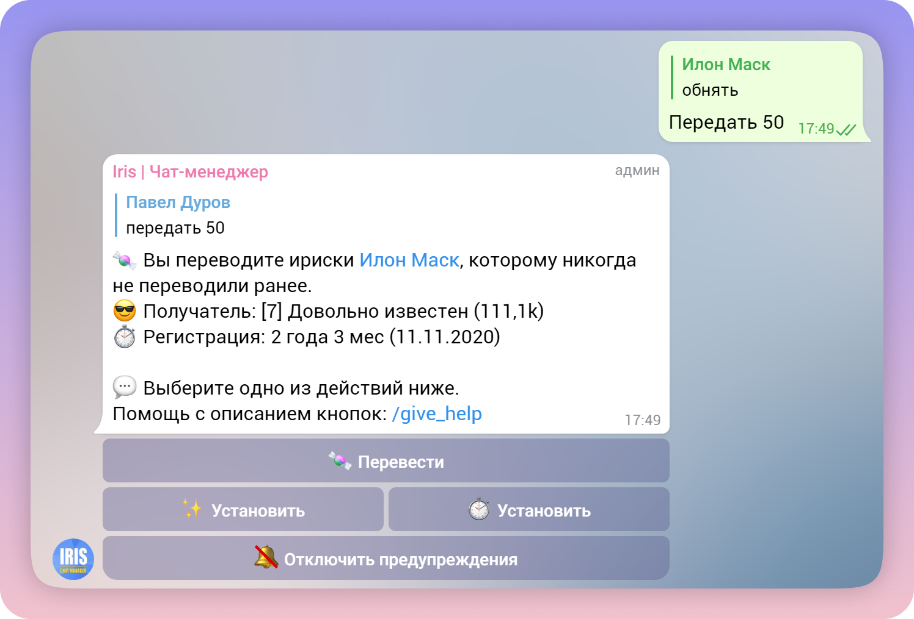  

Пример такого уведомления  

**Вы можете настроить такие уведомления:** установить условия при которых они будут появляться или вовсе их отключить.  

### Настройка порога передачи  

・**!Порог передачи** — главное меню, где можно посмотреть текущие настройки и быстро их изменить с помощью кнопок.  

・**!Порог передачи зв {число}** — минимальный порог для звёздности ✨. Отключает уведомление, если звёздность пользователя выше _{число}_.  

・**!Порог передачи рег {дата}** — минимальный порог для регистрации ⏱. Отключает уведомление, если пользователь в Ирисе дольше _{дата}_.  

> Узнать свою дату регистрации во вселенной Ириса можно с помощью следующей команды: `!регистрация`  

Кстати, при использовании двойного префикса для передачи ирисок, уведомление в любом случае не появится. Например: `!!передать (число)`  

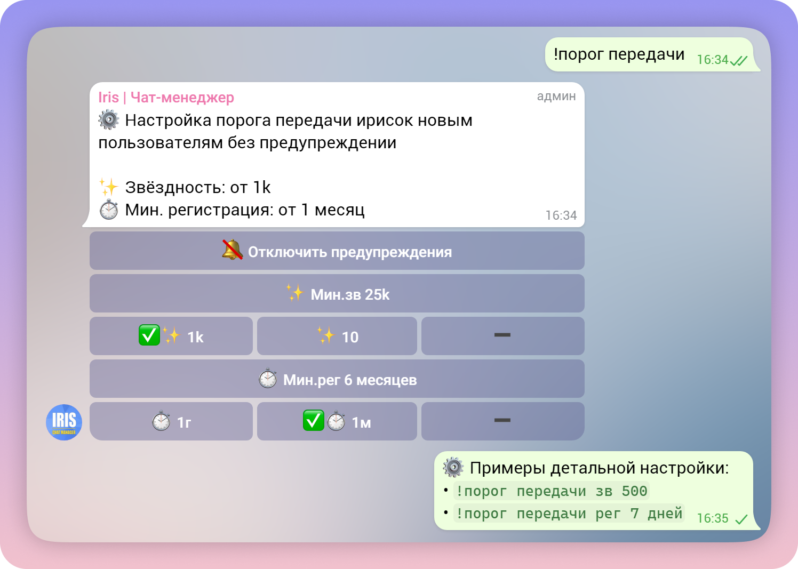  

### Отключение порога передачи  

・**\-Порог передачи** — отключит порог передачи. Предупреждения при переводе появляться не будут.  

### VIP-статус 💎  

**VIP-статус** — статус, позволяющий получить больше функций и выделится на фоне остальных участников чата.  

Благодаря VIP-статусу, вы сможете поставить себе эмодзи (значок) в никнейме, использовать свои ролевые команды, а также получить доступ ко многим другим функциям, доступным только VIP-пользователям.  

Также, если вы модератор чата, вы можете установить свою цену для покупки випа от 10 до 10 000 ирисок.  

### Подробнее о VIP-статусе — <https://teletype.in/@iris_cm/vip>  

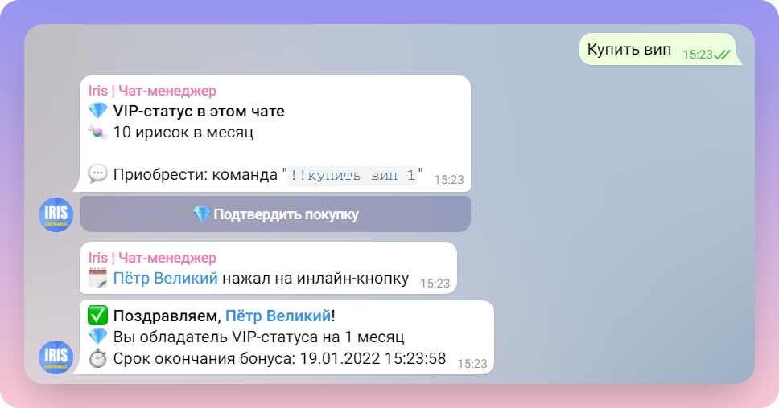  

> **Ограничить установку бонусов:** дк установка бонусов (ранг)
> **Ограничить бонус плюсопад:** дк плюсопад (ранг)
> **Ограничить бонус минусит:** дк минусит (ранг)
> **Ограничить бонус банхаммер:** дк банхаммер (ранг)
> **Ограничить анонимные сообщения:** дк анонимка (ранг)
> **Ограничить анонимные рп-команды:** дк анонимные рп (ранг)
> **Ограничить вызов баланса чата:** дк кубышка (ранг)  

**[Вернуться к оглавлению](#начало)**  

## 14. Развлекательные команды  

### Русская рулетка  

・**!Русская рулетка** — при проигрыше бот удаляет из чата (настроить исход можно при помощи триггеров).
_— Синонимы: ирис рулетка, !рулетка_  

### Дуэль  

・**Дуэль {ссылка}** / **Дуэль да** — по умолчанию при проигрыше бот удаляет из чата (настроить исход можно при помощи триггеров).
・**Дуэль отмена** — отменяет уже предложенную дуэль.  

### Кубы  

・**Кубы {ссылка}** / **Кубы да** — по умолчанию при проигрыше бот удаляет из чата (настроить исход можно при помощи триггеров).
・**Кубы отмена** — отменяет уже предложенную игру в кубы.  

### Погода  

・**!Погода {город}** — выводит погоду на 3 дня в указанном городе.  

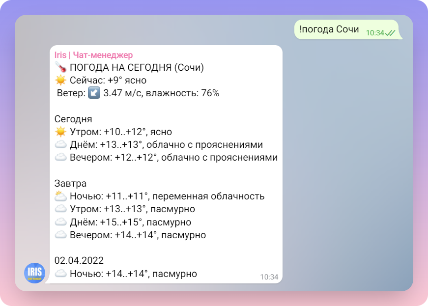  

### Шипперинг  

・**Шипперим** — шипперит случайных пользователей чата.
・**Шипперим** **{ссылка 1} {ссылка 2}** — шипперит выбранных участников.  

・**Пейринг** — список всех зашипперинных в чате.
・**Общий пейринг** — список всех зашипперинных ирисят.
・**!Сбросить пейринг** — очищает информацию о парах, которых Вы шипперили.  

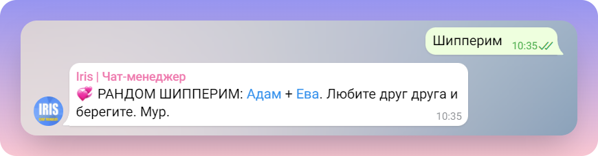  

### Повторить текст  

・**!Скажи \[enter\] {текст}** — бот повторит ваш текст от своего лица.  

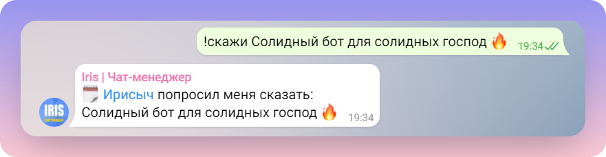  

### Ферма  

・**Ферма** — получить бесплатные ирис-коины. Получаемое количество колеблется в значении 5-50 i¢. Фармить можно раз в 4 часа.
_— Синонимы: !бизнес, фарма, фармить, !работа, !работать_  

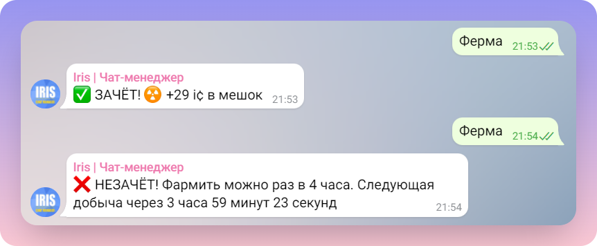  

### Остальные  

・**Рандом {число\_1} {число\_2}** — выводит случайное целое число в диапазоне от _{число\_1}_ до _{число\_2}_. Второй параметр необязателен, в этом случае будет считаться диапазон от 0 до _{число\_1}._  

・**!Инфа {текст}** — Ирис выдает рандомно % шанс.
・**!Выбери {первое} или {второе}** — Ирис выберет одно из предложенного.
・**!Данет {вопрос}** — Ирис выберет да / нет / неопределенно.
・**!Жребий {ссылки}** — Ирис выберет на кого пал жребий.
・**!Кто {текст}** — Ирис скажет кто {текст}.  

・**Пинг** / **Кинг** / **Пиу** / **Бот** — бот ответит Понг / Конг / Пау / На месте. Полезно для проверки работоспособности и задержки.  

### РП-команды  

> _**Пример:** Пожать руку {ссылка}_  

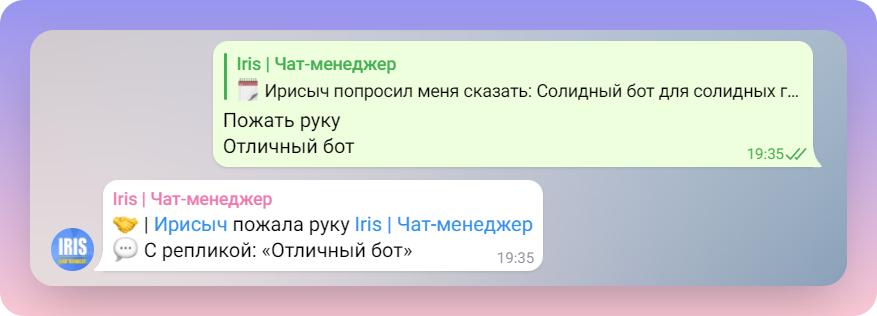  

Ирис старается быть доступным для всех категорий пользователей, поэтому мы ввели некоторые возрастные ограничения. Но их можно легко снять, переведя настройки на уровень 18+ командой «**рп доступ к 18+**».  

Имеющиеся уровни возрастных ограничений: `0+`, `13+` и `18+`.  

Важно понимать. Это не ограничение по вашему возрасту, указанному в Telegram. Это типы категорий команд. И старшие модераторы каждого чата сами решают, к рп-командам каких категорий будет открыт доступ.  

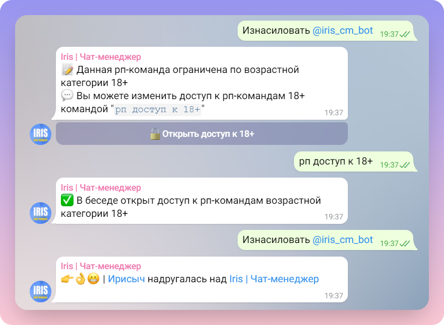  

> **Ограничить русскую рулетку:** дк русская рулетка (ранг) **Ограничить дуэли:** дк дуэль (ранг)
> **Ограничить ферму:** дк ферма (ранг) **Ограничить скажи:** дк скажи (ранг)
> **Ограничить шипперим:** дк шипперим (ранг)
> **Ограничить рандом:** дк рандом (ранг)
> **Ограничить инфу:** дк инфа (ранг)
> **Ограничить ирис выбери:** дк выбери (ранг)
> **Ограничить рп:** дк рп (ранг)
> **Ограничить рп всех:** дк рп всех (ранг)
> **Ограничить пасхалки:** дк пасхалка (ранг)
> **Ограничить да/нет:** дк данет (ранг)
> **Ограничить погоду:** дк погода (ранг)
> **Ограничить пинг:** дк пинг (ранг)  

**[Вернуться к оглавлению](#начало)**  

## 15. Мини-игра «Коронаирис: Био-войны»  

**Био-войны: Коронаирис** — новая игра во вселенной Ириса, в которой вам придётся прокачивать свои лаборатории и заражать людей.  

Помимо прокачки лабораторий, вы будете прокачивать самого себя, улучшать свои навыки. Чем лучше вы будете прокачаны, тем сложнее вас будет заразить. Лучшие будут попадать в локальный и глобальный топ вселенной Ириса.  

### Подробная информация по этой мини-игре: <https://teletype.in/@iris_cm/bioattack>  

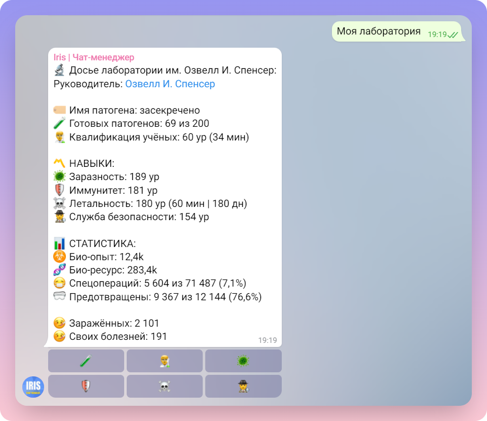  

> **Ограничить мини-игру:** дк био-атака {ранг}  

**[Вернуться к оглавлению](#начало)**  

## 16. Модуль «Дуэли»  

### Стандартная дуэль  

**Дуэль** — это бой между двумя участниками. Чтобы вызвать на бой, необходимо написать _«**дуэль**_ **{_ссылка_}**_»,_ а далее следовать инструкции, данной ботом.  

**・Кто дуэль** — приглашение сыграть в дуэль.
・**Дуэль да / Дуэль нет** — принять / отклонить вызов.
・**Дуэль отмена** — отменить вызов.
・**Выстрел** — выстрелить.
・**Прицелиться** — прицелиться и повысить шанс попадания следующего выстрела.
・**Сбросить прицел** — сбросить накопленные бонусы прицела.  

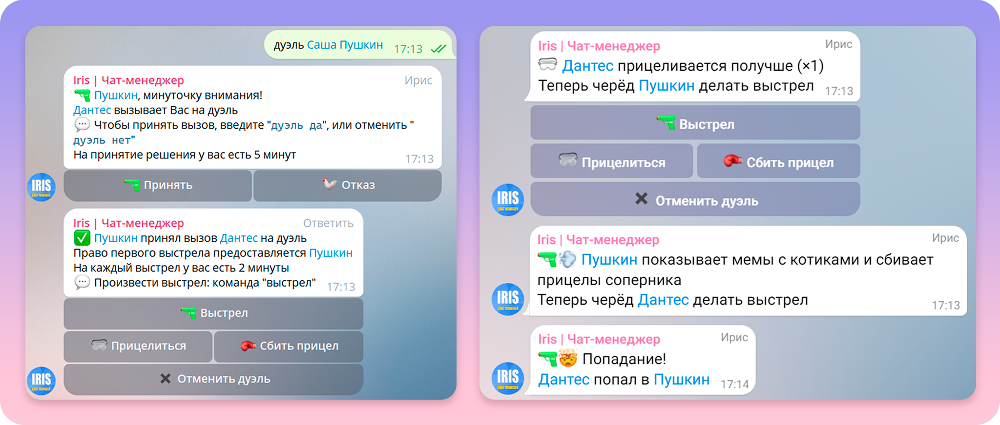  

При проигрыше Ирис исключает участника по умолчанию, но исход боя можно настроить:  

・**Дуэли исход 0 (ничего не делать)** ・**Дуэли исход кик** ・**Дуэли исход бан минута** ・**Дуэли исход бан 10 минут** ・**Дуэли исход бан час** ・**Дуэли исход бан сутки** ・**Дуэли исход бан навсегда**  

> Также настроить исход дуэлей можно с помощью триггеров.  

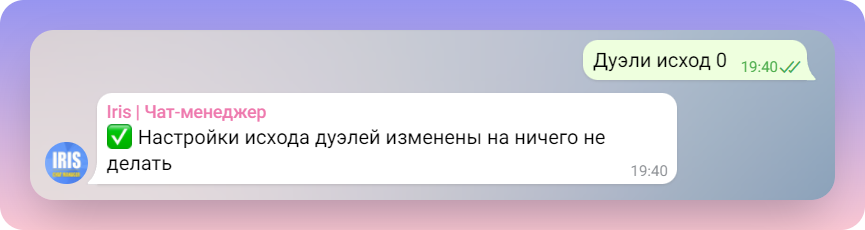  

・**Дуэли стата** — рейтинг дуэлянтов чата _(выигрыши | ничьи | проигрыши)._  

・**!Дуэли сброс** — сбрасывает статистику дуэлей.
_— Синоним: !сброс дуэлей_  

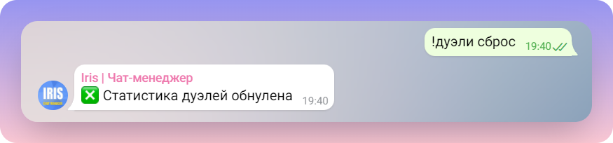  

### Золотая дуэль  

**Золотая дуэль** — это бой между двумя участниками на ирис-голд. Необходимо указать ставку командой «**_дуэль \[ставка\] {ссылка}_**». При выигрыше победитель получает в 2 раза больше ирис-голд.  

В отличие от обычной дуэли, Ирис не исключает проигравшего из чата, а все **специальные действия имеют свою цену**.
**・** _Прицелиться_ — 0,5% от ставки
**・** _Сбить прицел_ — 0,7% от ставки.
**・** _Отмена дуэли_ — 2% от ставки.
Оплата специальных действий взимается из мешка дуэлянта целым числом, непотраченная дробная часть Ирис-Голд записывается в **остаток**. Остаток будет использоваться для оплаты специальных действий в последующих золотых дуэлях.  

**・Золотые дуэли стата** — рейтинг золотых дуэлей 🌕  

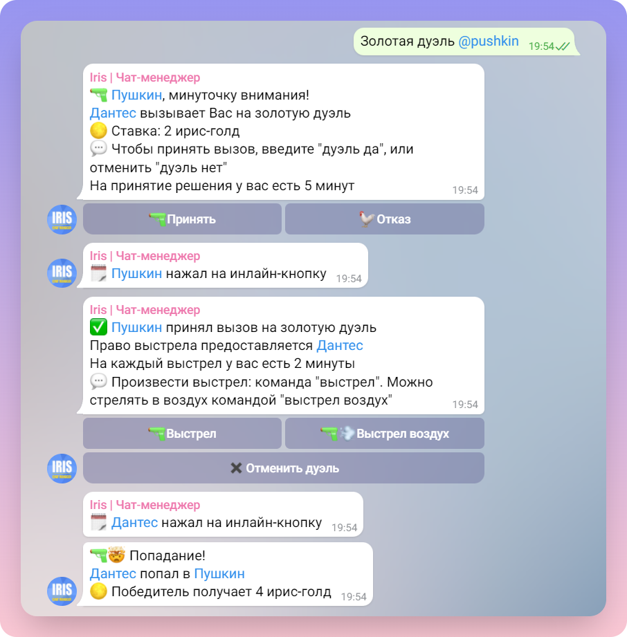  

> **Ограничить приглашение играть:** дк играть в дуэль (ранг)
> **Ограничить смену исхода:** дк исход дуэли (ранг)
> **Ограничить стату дуэлей:** дк статистика дуэлей (ранг)
> **Ограничить сброс статы дуэлей:** дк сброс дуэлей (ранг)  

**[Вернуться к оглавлению](#начало)**  

## 17. Модуль «Кубы»  

**Кубы** — альтернатива дуэлям, простой и быстрый способ узнать победителя.
Ирис бросает кубики с помощью встроенного в Телеграм механизма. Побеждает тот, у кого выпало больше точек.  

・**Кубы {ссылка}** — предложить сыграть в кубы конкретному пользователю.
・**Кто кубы** — предложить добровольцу сыграть в кубы.
・**Кубы да / нет** — согласиться / отказаться играть в кубы.
・**Кубы стата** — посмотреть статистику игр в вашем чате.  

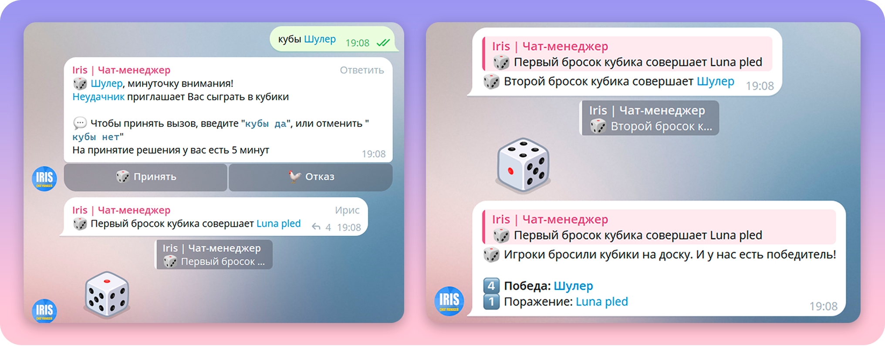  

・**Кубы исход бан / кик** — установить бан / кик в качестве наказания за проигрыш в кубах.
・**Кубы исход 0** — убрать наказание за проигрыш в кубах.  

> Также настроить исход кубов можно с помощью триггеров.  

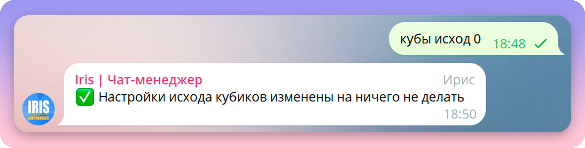  

### Золотые кубы  

> Игра в кубы, в которой участники делают ставку, а победитель получает её в двойном размере. При результате "Ничья" ставка возвращается к участникам.  

・**Кубы {ставка} {ссылка}** — предложить указанному пользователю сыграть на указанное число Ирис-голд.
・**Кто кубы {ставка}** — предложить добровольцу сыграть на указанное число Ирис-голд.  

**[Вернуться к оглавлению](#начало)**  

## 18. Модуль «Кланы»  

> **Кланы** — группировки внутри чата, включающие в себя неограниченное количество участников.  

Можно создать только один клан и состоять только в одном клане. При вступлении в другой клан, вы автоматически покинете предыдущий.  

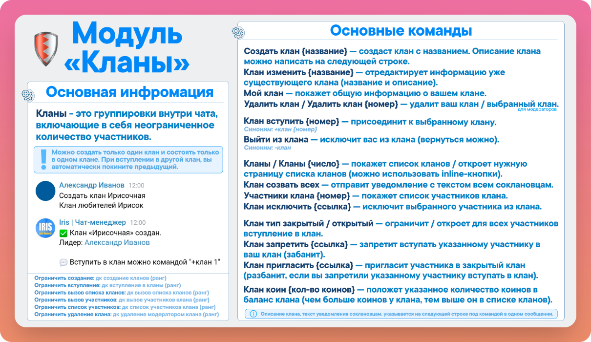  

### Общее  

・**Создать клан {название}** — создание клана с названием, описание можно сделать с новой строки.
・**Клан изменить {название}** — отредактирует информацию уже существующего клана (можно добавить описание на следующей строке).
・**Мой клан** — откроет общую информацию о вашем клане.
・**Удалить клан** — удаление своего клана.
・!**Удалить клан {номер}** — удаление клана под указанным номером. Для модераторов чата.  

### Вступление / выход  

・**Клан вступить {номер}** — присоединение к выбранному клану.
_— Синоним: +клан {номер} ・_**Выйти из клана** — выход из клана.
_— Синоним: -клан_  

### Списки кланов  

・**Кланы** — откроет список кланов чата (с поддержкой страниц).
・**Кланы {номер страницы}** — откроет сразу нужную страницу списка кланов.  

### Репутация клана  

・**Клан коины {число}** — увеличит репутацию клана. Чем больше репутации у клана, тем выше он в списках клана.  

### Типы клана  

・**Клан тип закрытый** — ограничит вступление в клан. В клан теперь можно будет вступить только по приглашениям.
・**Клан тип открытый** — откроет вступление в клан для всех. Теперь каждый сможет присоединиться в клан.  

### Модерация  

・**Клан созвать всех** — отправляются уведомления с призывом всем сокланам.
・**Участники клана {номер}** — список участников клана / сокланы.
・**Клан исключить {ссылка}** — удалит выбранного участника из клана.
・**Клан запретить {ссылка}** — запретит выбранному участнику вступать в клан.
・**Клан пригласить {ссылка}** — отправит приглашение на вступление в клан.  

> **Ограничить создание:** дк создание кланов (ранг)
> **Ограничить вступление:** дк вступление в кланы (ранг)
> **Ограничить вызов списка кланов:** дк вызов списка кланов (ранг)
> **Ограничить вызов участников клана:** дк вызов участников клана (ранг)
> **Ограничить вызов списка участников:** дк список участников клана (ранг)
> **Ограничить удаление клана:** дк удаление модератором клана (ранг)  

**[Вернуться к оглавлению](#начало)**  

## 19. Модуль «Кружки»  

> Аналогия «**Кланам**» — несколько группировок внутри чата по интересам.  

В отличие от кланов, можно создать несколько кружков и быть участником в нескольких кружках одновременно.  

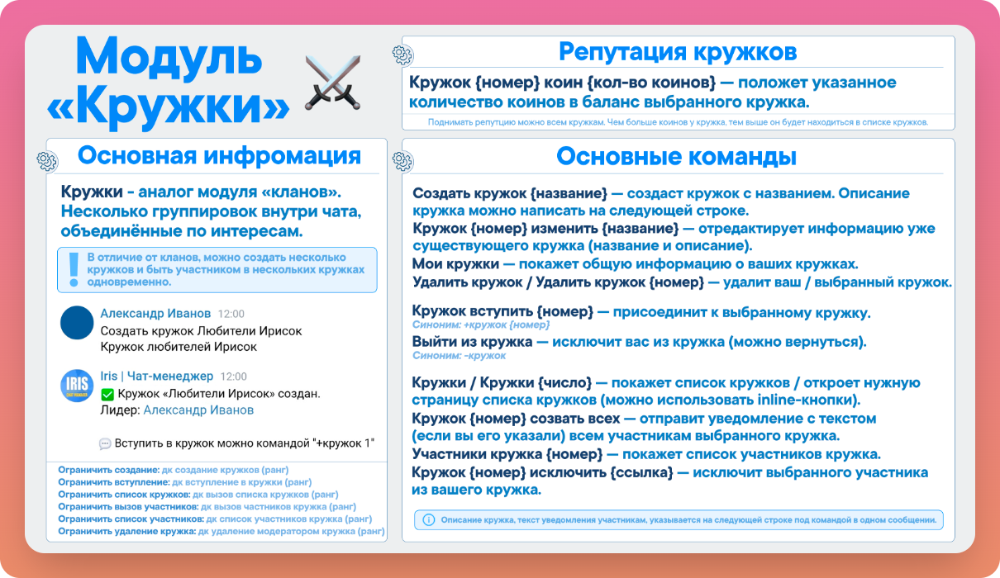  

### Общее  

・**Создать кружок {название}** — создание кружка с названием, описание можно сделать с новой строки.
・**Кружок {номер} изменить {название}** — отредактирует информацию уже существующего кружка (можно добавить описание на следующей строке).
・**Кружок основа {номер}** — сделает основным кружок. В команде "мои кружки" будет помечаться \*.
・**Удалить кружок {номер}** — удаление своего кружка.  

### Вступление / выход  

・**Кружок вступить {номер}** — присоединение к выбранному кружку.
_— Синоним: +кружок {номер}_ ・**Выйти из кружка {номер}** — выход из кружка.
_— Синоним: -кружок {номер}_  

### Списки кружков  

・**Кружки** — откроет список кружков чата.
・**Кружки {номер страницы}** — откроет сразу нужную страницу списка кружков.
・**Мои кружки** — откроет список ваших кружков.  

### Репутация кружков  

・**Кружок {номер} коины {число}** — увеличит репутацию выбранного кружка. Чем больше репутации у кружка, тем выше он в списках кружков.  

### Модерация  

・**Кружок {номер} созвать всех** — отправляются уведомления с призывом всем соучастникам.
・**Участники кружка {номер}** — список участников кружка / соучастников.
・**Кружок исключить {ссылка}** — удалит выбранного участника из кружка.  

> **Ограничить создание:** дк создание кружков (ранг)
> **Ограничить вступление:** дк вступление в кружки (ранг)
> **Ограничить список кружков:** дк вызов списка кружков (ранг)
> **Ограничить вызов участников:** дк вызов участников кружка (ранг)
> **Ограничить список участников:** дк список участников кружка (ранг)
> **Ограничить удаление кружка:** дк удаление модератором кружка (ранг)  

**[Вернуться к оглавлению](#начало)**  

## 20. Модуль «Отношения»  

> **Отношения** — интерактивные действия между участниками, повышающие ваш уровень взаимоотношений.  

Существует **более 13** уровней отношений. Для перехода на следующий уровень необходимо получить определённое количество опыта отношений.  

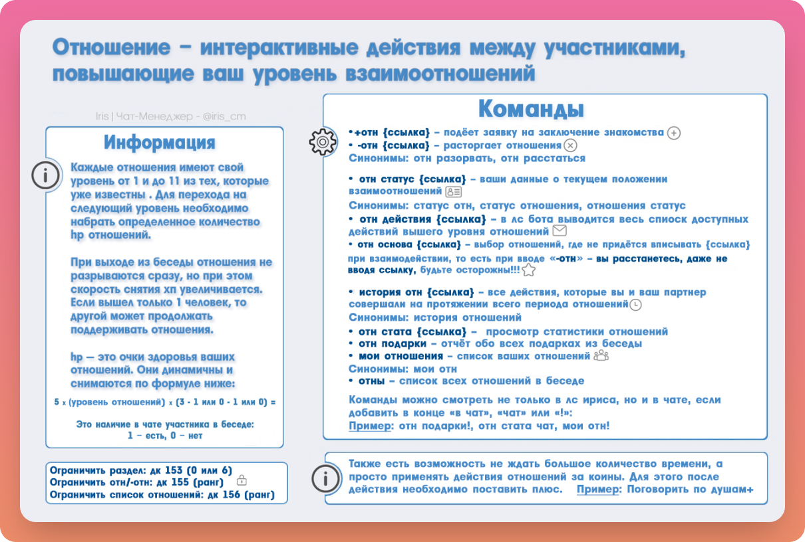  

По умолчанию команды отправляются в [**л/с Ириса**](https://t.me/iris_cm_bot).
Если хотите вывести в чат, можете указать суффикс **«в чат»** или **«!»**.
Например: «**отн стата в чат @id**», «**отн подарки!**»  

### Команды  

・**+Отн {ссылка}** — подаёт заявку на заключение / восстановление отношений.
・**\-Отн {ссылка}** — расторгает отношения / отменяет заявку.
_— Синонимы: отн разорвать, отн расстаться_ ・**Отн да** — принимает заявку на заключение / восстановление отношений.
・**Отн нет** — отклоняет заявку на заключение / восстановление отношений.  

> После расставания у вас есть 30 дней на восстановление своих отношений. Это как вызов настоящей любви: чем дольше вы находитесь в разлуке, тем больше снижается крепость ваших отношений (от 5% до 50%).  

・**Отн основа {ссылка}** — выбор отношений, где не придётся вписывать {ссылка} при взаимодействии.
・**Статус отн {ссылка}** — откроет информацию о текущем положении взаимоотношений
_— Синоним: отн статус, статус отношений, отношения статус_  

・**История отн {ссылка}** — откроет список действий, которые вы и ваш партнер совершали
_— Синоним: история отношений_ ・**Мои отношения** — откроет список ваших отношений.
_— Синоним: мои отн_  

・**Отны** — откроет список основных отношений в чате.
・**Отны {номер страницы}** — откроет сразу нужную страницу списка основных отношений.  

・**Отн стата {ссылка} —** выводит статистику по действиям в указанных отношениях.
・**Отн подарки** — откроет список всех ваших подарков.  

・**Отн действия {ссылка}** — откроет список действий (✅ — действие доступно; 🕔 — откат времени; 🔓 — безлимитное рп; ☢️ — рп за ирис-коины).  

> _**hp** — это очки здоровья ваших отношений. Они динамичны и снимаются раз в час по формуле: **5 × уровень × (3 - (1 или 0) - (1 или 0))=? 1** или **0** — это наличие в беседе участников, сначала первого, потом второго: **1** — да, **0** — нет_  

  

> **Ограничить отны:** дк вызов списка отношений (ранг)
> **Ограничить создание отн:** дк отн/-отн (ранг)  

**[Вернуться к оглавлению](#начало)**  

## 21. Модуль Браки  

> **Браки** — зарегистрированные отношения между участниками. **В течение трёх** дней после расторжения брака союз можно восстановить без потери срока.  

### Общие команды  

・**Брак {ссылка}** — отправит предложение на создание / восстановление брака.
・**!Развод** — расторгает брак.  

・**Брак да** — принимает предложение создать / восстановить брак.
・**Брак нет** — отклоняет предложение создать / восстановить брак.  

・**Мой брак** — откроет общую информацию о вашем браке.
・**Твой брак {ссылка}** — откроет общую информацию о браке пользователя.  

・**Браки** — откроет список всех браков в чате.
・**Браки {номер страницы}** — откроет сразу нужную страницу списка браков.  

・**Поженить пару {ссылка} {ссылка}** — создаёт брак между выбранными пользователями.
・**Развести пару {ссылка} {ссылка}** — расторгает брак между выбранными.  

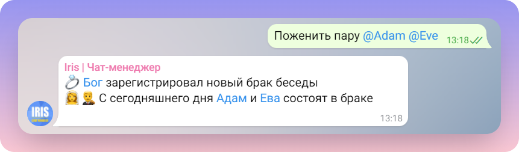  

・**!Сброс браков** — обнуляет список всех браков чата.
・**Развести вышедших** — расторгает браки ранее вышедших участников в соответствии с установленным режимом развода.  

### Продление брака  

・**Брак цена продления {число}** — установит цену продления браков.
・**Брак продлить {кол-во дней}** — продлит количество дней в браке.  

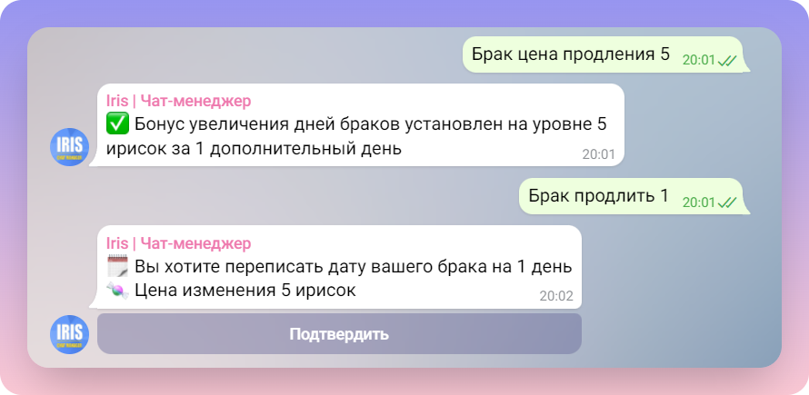  

### Топ браков  

・**Топ браков** — откроет рейтинг самых долгих браков во вселенной Ириса.
・**Топ браков {номер страницы}** — откроет сразу нужную страницу топа браков.  

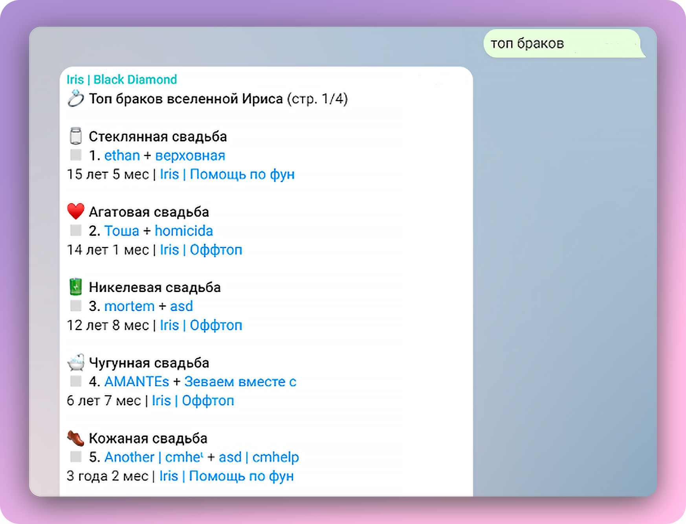  

・**+Брак рейтинг** — включает вашу пару в топ браков.
・**\-Брак рейтинг** — исключает вашу пару из топа браков.  

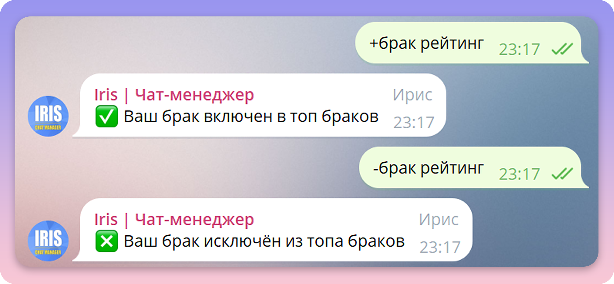  

### Авторазвод браков  

・**Брак режим развода выключить** — отключает в вашем чате автоматическое расторжение брака после выхода участников.
・**Брак режим развода один** — включает авторазвод браков после выхода одного супруга из чата.
・**Брак режим развода оба** — включает авторазвод браков после выода двух супруг из чата.  

> **Ограничить брак/развод:** дк брак (ранг)
> **Ограничить вызов списка браков:** дк вызов списка браков (ранг)
> **Ограничить поженить пару:** дк поженить пару (ранг)
> **Ограничить развести пару:** дк развести пару (ранг)
> **Ограничить сброс браков и настройку режима:** дк управление браками (ранг)  

**[Вернуться к оглавлению](#начало)**  

## 22. Модуль «Репутация»  

> Пользователи в чате имеют свою репутацию, которую они могут заработать от других пользователей, выражающих им своё уважение.  

Репутацию можно повышать плюсиками (**++++**) к пересланному сообщению пользователя.
_— Синонимы: лайк, респект, F, уважение, увожение, жиза, жыза, плюс, красавчик, справедливо, meine respektierung_  

**На плюсы в рейтинге налог** — **раз в три дня снимается 5% На коины в рейтинге налог** — **раз в два дня снимается 1%** Это сделано для динамичности топов  

### Основные команды  

**・Рейтинг** — вызывает таблицу рейтинга пользователей чата.
**・+{число}** — повышает репутацию пользователя, чьё сообщение плюсуется.
**・-{число}** — снижает репутацию пользователя, чьё сообщение минусуется.
**・\*{число}** — повышает звёздную репутацию пользователя, чьё сообщение отмечается звёздочкой.
_— Синоним: ^{число}_  

> Чем выше ранг, тем больше плюсиков за 1 раз вы можете ставить пользователю.  

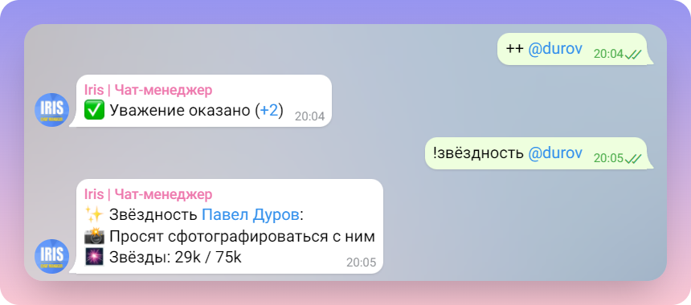  

**・!Сбросить рейтинг** — обнуляет рейтинг всех участников.
_— Синоним: !обнулить рейтинг_  

### Звёздный рейтинг ✨  

**・Звёздность {ссылка}** — показывает уровень звёздности указанного пользователя.
_— Синонимы: !зв, звездность_ **・Моя звёздность** — показывает ваш уровень звёздности.
_— Синонимы: мзв, моя звездность_  

**・Звёзды чата** — показывает рейтинг участников чата со звёздами в репутации.
**・Все звёзды** — показывает рейтинг участников со звёздами в репутации (среди всех ирисят).
**・Хранители звёзд** — показывает рейтинг участников со звёздами в мешке (в чате).  

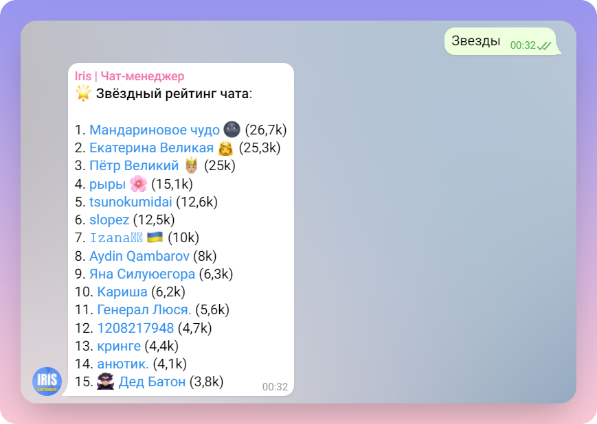  

### Золотой рейтинг 🌕  

**・Золотой рейтинг** — показывает рейтинг участников с ирис-голд (среди всех ирисят).  

> Чтобы попасть в этот топ, вы должны открыть свой мешок для всех.
> Команда: **+мешок**  

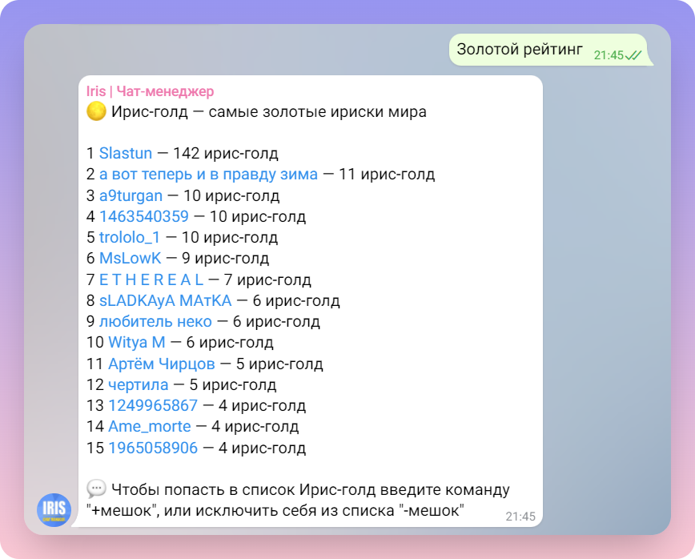  

### Рейтинг коинов ☢️  

**・Бкоин {число}** — передать {число} коинов в пользу чата.
**・Бтоп** — показывает топ чатов по i¢.
**・Бтоп дня** — показывает топ чатов по i¢ по начисленным с начала дня коинам.
**・Штоп** — показывает топ ирис-коин шахтёров чата.  

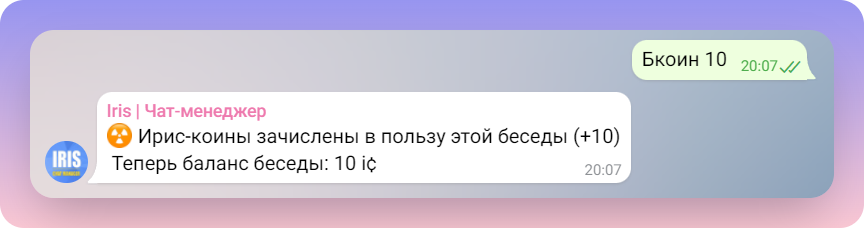  

> **Ограничить плюсы:** дк плюсы (ранг)
> **Ограничить вызов рейтинга репутации:** дк вызов рейтинга (ранг)
> **Ограничить сброс рейтинга репутации:** дк сброс рейтинга (ранг)
> **Ограничить вызов гтоп, бтоп:** дк бтоп (ранг)
> **Ограничить топ шахтеров:** дк топ шахтеры (ранг)  

**[Вернуться к оглавлению](#начало)**  

## 23. Модуль «Награды»  

> Вы можете награждать особо отличившихся пользователей в вашем чате наградными медалями.  

Каждый ранг может выдавать определённую степень для участника. Допустим, 1 ранг не сможет выдать участнику награду с 8 степенью, а только с 1 степенью и не больше.  

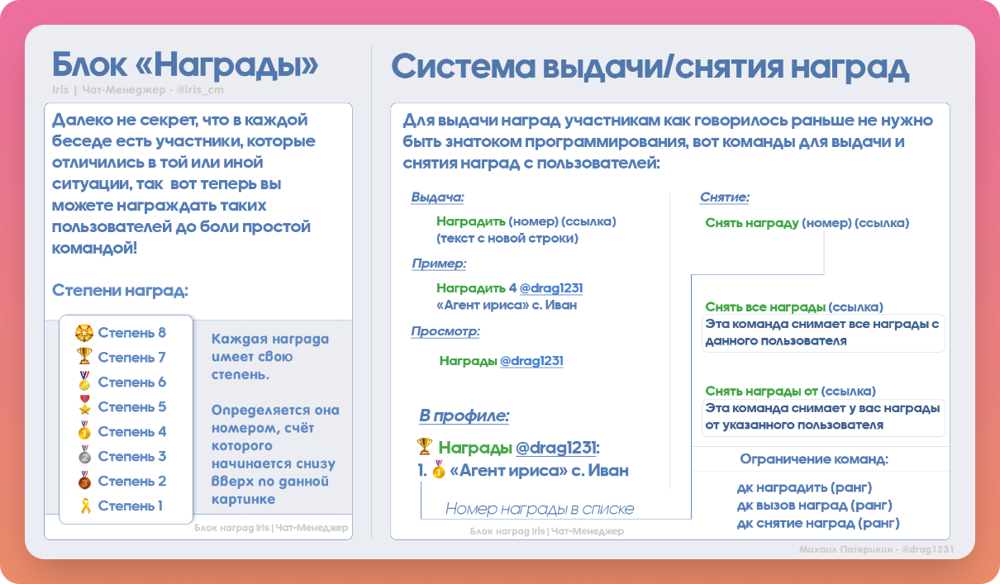  

**・Наградить {число 1..8} {ссылка} {enter} {описание}** — награждает пользователя медалью со степенью _{число}_. Параметр _«степень={число}»_ необязательный. По умолчанию указывается степень 1. Описание награды обязательно для заполнения.  

> _**Пример:** Наградить 3 @irisism За создание Ириса_  

**・Снять все награды {ссылка}** — снимает все награды с указанного пользователя.
**・Снять награды от {ссылка}** — снимает все награды, которые присуждал указанный пользователь.
**・Снять награду {номер} {ссылка}** — снимает награду под номером _{номер}_ у указанного пользователя.
**・Награды {ссылка}** — чтобы посмотреть награды участника.  

> Каждый ранг может выдавать определённую степень для участника. Допустим, 1 ранг не сможет выдать участнику награду с 8 степенью, а только с 1 степенью и не больше.  

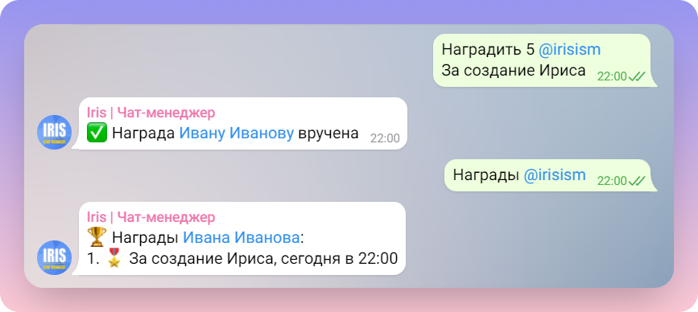  

> **Ограничить выдачу награды:** дк наградить (ранг)
> **Ограничить вызов наград:** дк вызов наград (ранг)
> **Ограничить снятие наград:** дк снятие наград (ранг)  

**[Вернуться к оглавлению](#начало)**  

## 24. Модуль «Закладки»  

Смысл данного модуля заключается в том, чтобы разметить огромные потоки переписки на темы, которые поднимались в чате. Например, вы беседовали о качестве игры «ФИФА». Вы можете добавить закладку на начало этой дискуссии, а позже другие заинтересованные в этой теме участники могут перейти к ней и прочитать дискуссию.  

> **+Закладка {название} \[enter\] {текст/вложения}** — установит закладку.
> Где **\[enter\]** — переход на новую строчку.  

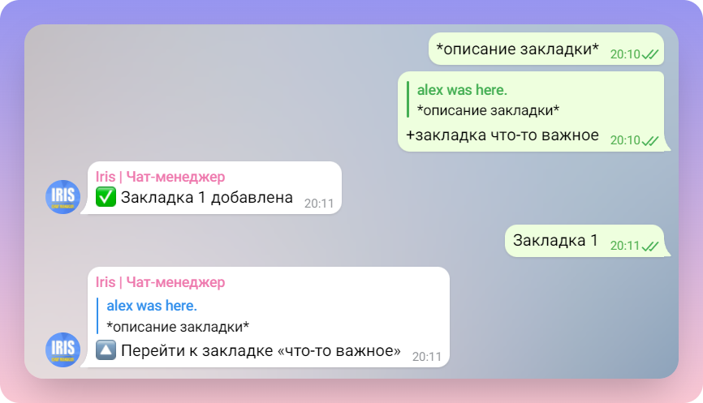  

Закладки всех пользователей формируют **чатбук**. Любой желающий имеет доступ к нему, вызвав команду «**_чатбук_**».  

> При нажатии на название закладки, вы сразу же перейдёте к сообщению.  

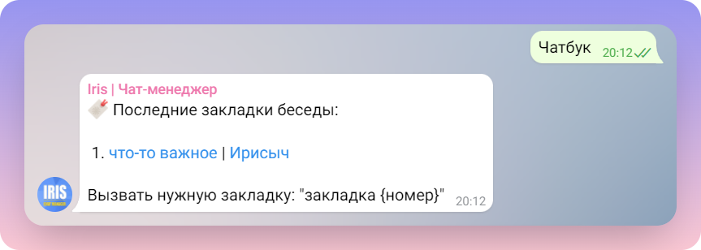  

### Создание закладок  

**・+Закладка {название} \[enter\] {текст/вложения}** — установит закладку пользователя с указанным описанием.
**・+Закладка {название} _(в ответ на сообщение)_** — установит закладку пользователя на месте, указанном в пересылаемом сообщении.  

### Просмотр закладок  

**・Закладка {номер}** — вызывает закладку под номером _{номер}._  

**・Чатбук** — откроет список всех закладок чата.
**・Чатбук {номер страницы}** — откроет нужную страницу списка закладок.  

**・Мои закладки** — откроет полный список закладок пользователя, вызвавшего команду.
**・Мои закладки {номер страницы}** — откроет нужную страницу списка закладок пользователя, вызвавшего команду.  

**・Закладки {ссылка}** — откроет полный список закладок пользователя.
**・Закладки {ссылка}** **{номер страницы}** — откроет нужную страницу списка закладок пользователя  

### Удаление закладок  

**・Удалить закладку {номер}** — удаляет закладку под номером _{номер}._ Доступ к команде имеет автор закладки и модераторы.
_— Синоним: -закладка {номер}_ **・Исключить закладку {номер}** — исключает закладку под номером _{номер}_ из чатбука, но не удаляет из закладок автора_._ Доступ к команде имеет автор закладки и модераторы.
_— Синоним: убрать закладку_  

### Другие команды  

**・+Кладмен {ссылка}** / **-Кладмен {ссылка}** — возвращает / исключает все закладки пользователя из чатбука.
_— Синонимы: вернуть кладмена, освободить кладмена, закрыть кладмена, убрать кладмена_ **・Закладки рейтинг {число}** — создавать закладки могут только пользователи с репутацией от уровня _{число}._  

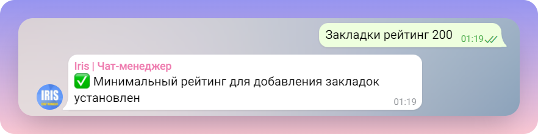  

> **Ограничить добавление:** дк добавить закладку (ранг)
> **Ограничить вызов закладки:** дк вызвать закладку (ранг)
> **Ограничить чатбук:** дк чатбук (ранг)
> **Ограничить удаление закладок:** дк модерация закладок (ранг)  

**[Вернуться к оглавлению](#начало)**  

## 25. Модуль «Заметки»  

> **Заметки** — то же, что и закладки, но не пересылают на место сохранения текста, как в закладках. Если коротко, это шаблоны у бота.  

### Команды  

**・+Заметка {название}** **\[enter\] {описание}** — создаёт новую заметку.
**・-Заметка {название или номер}** — удаляет заметку.
**・~Заметка {название или номер} \[enter\]** **{новое описание}** — отредактирует всё содержание заметки с разметкой.
**・~Название заметки {название или номер} \[enter\] {новое название}** — отредактирует название заметки (можно указать новое название).
**・Текст заметки {название или номер}** **\[enter\] {новый текст}** — отредактирует текст заметки без разметки (жирный текст, курсив и т.д...).
**・Заметки** — вызывает список всех заметок.
**・Заметки {номер страницы}** — откроет сразу нужную страницу списка заметок.  

> Максимальная длина названия 40 символов, описания ~ 4000 символов.  

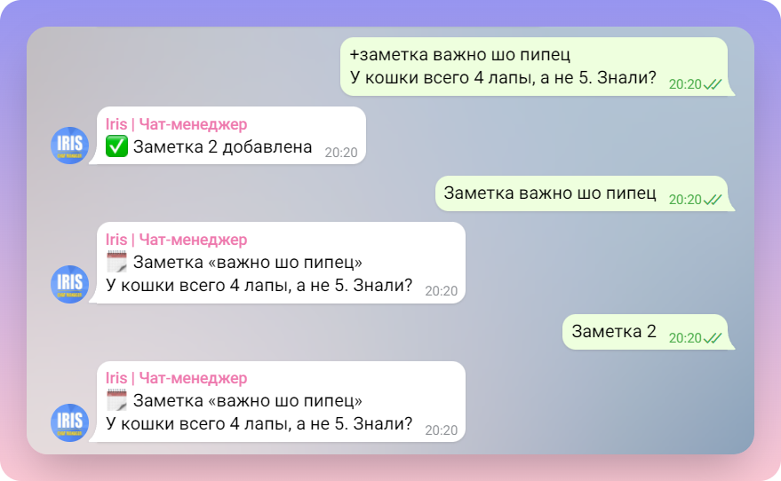  

> **Ограничить удаление и редакцию:** дк управление заметками (ранг)
> **Ограничить вызов заметки:** дк вызвать заметку (ранг)
> **Ограничить список заметок:** дк вызов списка заметок (ранг)  

**[Вернуться к оглавлению](#начало)**  

## 26. Модуль «Таймеры»  

**Таймеры** — это отложенные функции, заданные Ирису. Установить «отложку» можно как на простые игровые команды, так и на любой другой функционал от 1 минуты и до 1 года.  

Доступны таймеры модераторам от 1 ранга, а так же участникам, имеющим VIP. Всего можно сделать до 5 таймеров на 1 чат.  

### Таймер через  

**・Таймер через {период} {enter} {команда}** — создает таймер. Период писать в минутах, часах, днях, неделях, месяцах. **В пределах 1 года.**  

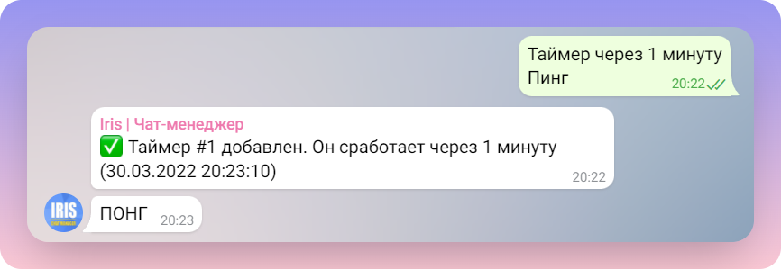  

### Таймер на  

**・Таймер на {дд.мм.гг чч:мм} {enter} {текст или команда}** — создает таймер на определенную дату и срок. Все временные параметры указывать необязательно.  

> **{дд.мм.гг чч:мм}** — день.месяц.год часы:минуты  

  

**・Таймеры** — список ваших таймеров в данном чате.
**・-Таймер {номер}** — удаление выбранного таймера.
**・!Сбросить таймеры** — удаление всех таймеров.
_— Синоним: !удалить все таймеры_  

> **Ограничить таймер:** дк таймер (ранг)  

**[Вернуться к оглавлению](#начало)**  

## 27. Модуль «Каталог»  

Ирис имеет каталог чатов, расположенный на [сайте](https://iris-tg.ru/chats/). Ваш чат также может расположиться там. Для этого достаточно добавить Ириса в чат в качестве администратора — заявка в каталог будет отправлена автоматически.  

Вы можете выбирать категории, в которых будет представлен ваш чат, а также указывать ссылку, чтобы пользователи автоматически присоединялись. Если ссылки нет, указывается создатель чата, как контакт для добавления.  

### Основные команды  

**・Каталог добавить** — отправляет заявку на добавление в каталог. На следующей строчке можно указать описание чата.
**・Каталог добавить** — обновляет информацию о вашем чате в каталоге: название, фотографию и описание (при указании).
**・Каталог отменить** — отменяет подачу заявки на добавление / обновление информации.
**・Каталог удалить** — удаляет чат из каталога.  

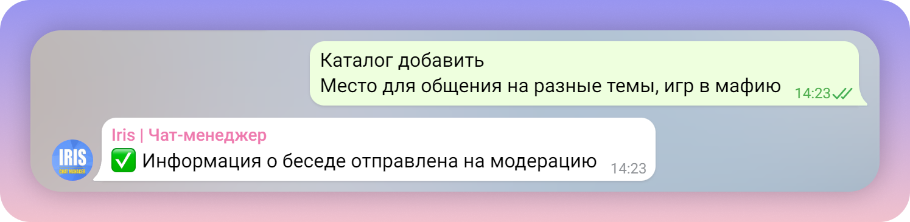  

### Категории каталога  

・**Каталог категории** — выводит все категории
・+**Каталог категории {номера}** — привязывает чат к категориям каталога с перечисленными через пробел номерами.
・-**Каталог категории {номера}** — исключает чат из перечисленных через пробел номеров категорий.  

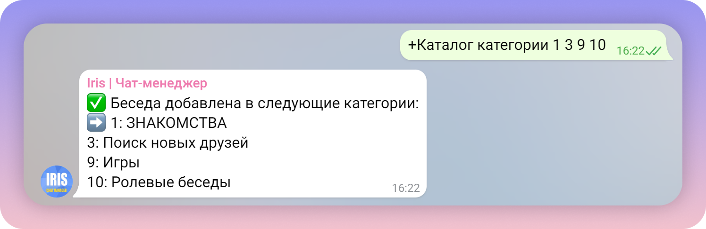  

### Отображение модерации  

**・+Каталог модераторы** — включить отображение модераторов чата на сайте.
**・-Каталог модераторы** — отключить отображение модераторов чата на сайте.  

### Полная информация о каталоге, с условиями добавления, доступна в отдельной статье — <https://teletype.in/@iris_cm/catalog>  

> **Ограничить управление каталогом:** дк управление каталогом (ранг)
> **Ограничить настройки каталога:** дк настройки каталога (ранг)  

**[Вернуться к оглавлению](#начало)**  

## 28. Модуль «Карта»  

**На данный момент модуль работает некорректно!**  

**Модуль «Карта»** — это география чата. Вы можете наглядно увидеть, как располагаются участники беседы прямо на карте  

  

**・Карта** — выводит ссылку на страницу карты вашего чата.
**・Карта {город}** — устанавливает ваше новое местоположение на карте. Если команда выполнена в чате, то город указывается для конкретного чата. Если команда выполнена в **[л/с бота](https://t.me/iris_cm_bot)**, то город будет отображаться во всех беседах.
**・Карта помощь** — выводит справку по модулю _«Карта»._ **・Кто из {город}** — выводит список участников чата из данного города.  

> Изменения записываются в вашу анкету, которую вы можете вызвать по команде «**моя анкета**».  

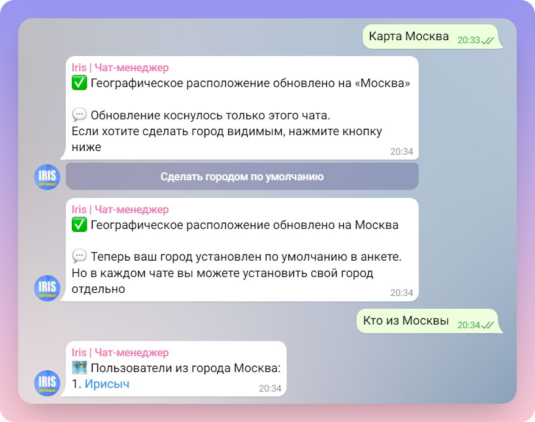  

> **Ограничить вызов карты:** дк вызов карты (ранг)
> **Ограничить назначение города:** дк назначение города (ранг)
> **Ограничить кто из:** дк кто из города (ранг)
> **Ограничить карта скан:** дк обновление карты (ранг)  

**[Вернуться к оглавлению](#начало)**  

## 29. Модуль «Ирис-биржа»  

**Ирис-голд (золотые ириски)** — инвестиционный инструмент, позволяющий заработать на разнице курсов. Подобно цифровой валюте Bitcoin курс формируется согласно спросу и предложению. Цена формируется из заявок на покупку и продажу от участников вселенной Ириса.  

**!!! ВАЖНО !!!** Ваша прибыль от вложений в ирис-голд не гарантируется. Нужно понимать риски участия на бирже — перегревы курса и его негативную динамику.  

> Если коротко, то смысл биржевой торговли: купил за 1 ириску — продал за 3  

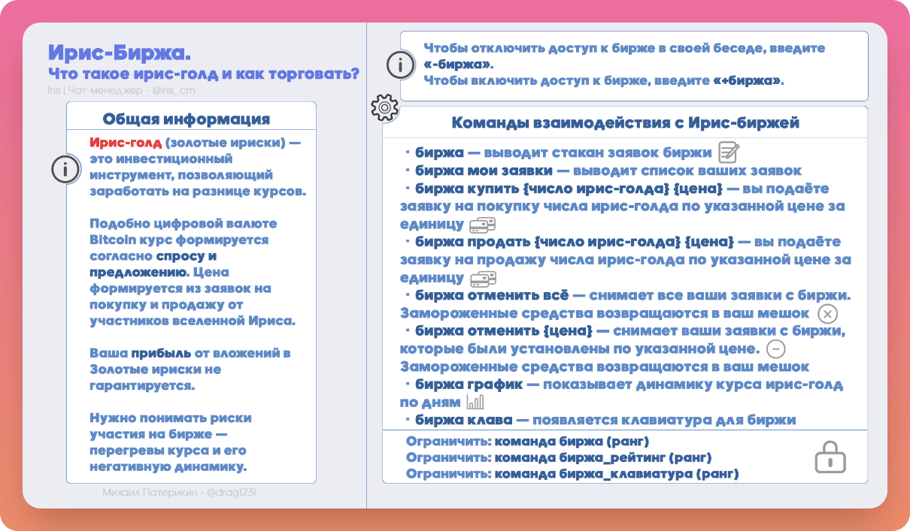  

> **Ограничить настройки биржи:** дк настройки биржи (ранг)
> **Ограничить вызов графиков:** дк вызов графиков (ранг)  

**[Вернуться к оглавлению](#начало)**  
