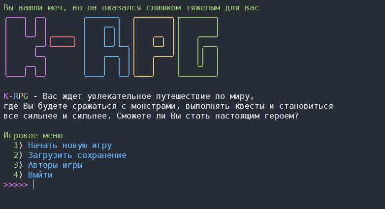
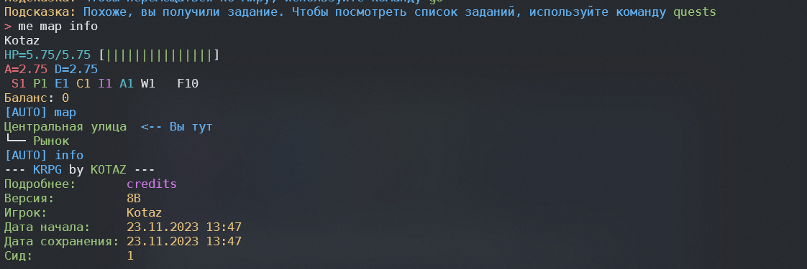
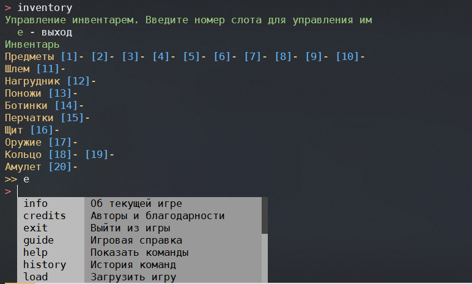

Что такое КРПГ? Моя собственная игрушка. Текстовая рпг игра на python. Вас ждет увлекательное путешествие по миру, где Вы будете сражаться с монстрами, выполнять квесты и становиться все сильнее и сильнее. Сможете ли Вы стать настоящим героем?

## 🧐 Об игре

**KRPG** - захватывающая приключенческая игра, где вы, исследователь-путешественник, направляетесь в деревню с целью пополнения запасов. Однако прибытие в деревню сталкивает вас с загадочными событиями, заставляя вас задержаться и помочь разгадать тайны и решить проблемы. Ваш выбор остаться открывает двери к опасным приключениям, и вы сталкиваетесь с разнообразными персонажами, каждый из которых несет свои собственные секреты. Ваше путешествие станет важным моментом в судьбе деревни, выяснить происходящее станет вашим главным вызовом. Сможете ли вы раскрывать тайны и разузнать, что же за тайны, хранит этот мир?

## 🏁 Установка

### 💻 Linux

Установка:

```bash
pip install rich prompt_toolkit msgpack urllib3 requests
curl https://raw.githubusercontent.com/kotazzz/krpg/master/updater.py | python
```

Запуск:

```bash
python -m krpg
```

### 🪟 Windows

Скачайте установщик [отсюда](https://github.com/kotazzz/krpg/raw/master/bin/install.exe). Установщик содержит Python, необходимый для запуска игры. Установщик представляет собой SFX архив 7z, который содержит портативную версию Python и предустановленные библиотеки.

#### Инструкции по установке

1. Загрузите архив `install.exe` из папки ссылка на папку.
1. Запустите `update.bat`, чтобы установить или обновить файлы.
1. После установки запустите игру, используя `run.bat`.
1. В случае повреждения файлов или необходимости обновления, также можно использовать `update.bat`.

#### Системные требования

- Операционная система Windows 10 или новее
- Доступ к интернету для загрузки дополнительных файлов (при первом обновлении)

#### Содержимое

- Python
- Предустановленные библиотеки: `requests`, `urllib3`, `msgpack`, `prompt_toolkit`, `rich`
- Скрипты для установки и обновления

## 🎈 Скриншоты







## ✍️ Авторы

- [@kotazzz](https://github.com/kotazzz) - Идея и реализация

## 🎉 Информация

Правила поведения можно почитать [здесь](CODE_OF_CONDUCT.md)
Я буду рад увидеть вас в своем телеграм канале, где я часто публикую интересные детали. Вот [ссылка](https://t.me/krpgd) на него.
Так же мы можем встретиться на [дискорд сервере](https://discord.gg/FKcURWZsMW)
