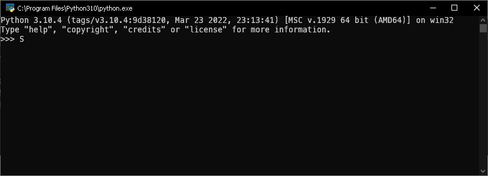

## Введение

Python - высокоуровневый, интерпретируемый язык программирования общего назначения.

### Характеристики

- Простота чтения и написания кода: Чистый и лаконичный синтаксис упрощает разработку и обслуживание программ.
- Интерпретируемость: Код выполняется интерпретатором пошагово, что облегчает тестирование и отладку.
- Динамическая типизация: Переменные определяют свой тип в процессе выполнения, что обеспечивает гибкость и удобство.

### Плюсы

- Кросс-платформенность: Работает на различных операционных системах.
- Большое сообщество: Обширное сообщество и множество библиотек, что упрощает разработку.
- Многозадачность: Поддерживает параллельное и асинхронное программирование.

### Минусы

- Производительность: Может быть медленнее по сравнению с некоторыми компилируемыми языками.
- Ограничения в мобильной разработке: Не всегда является оптимальным выбором для мобильных приложений.

### Области применения

- Веб-разработка: Фреймворки, такие как Django и Flask, популярны для создания веб-приложений.
- Анализ данных и машинное обучение: Библиотеки NumPy, Pandas, и библиотеки для машинного обучения, такие как TensorFlow и PyTorch.
- Скриптовые задачи: Используется для автоматизации и скриптов в различных областях.
- Искусственный интеллект и робототехника: Python часто применяется в этих областях.

### Особенности

- Динамическая типизация: Переменные могут менять тип в процессе выполнения.
- Сборщик мусора: Автоматически управляет памятью.
- Большое количество библиотек: Обширный экосистем Python обеспечивает готовые решения для многих задач.
- Python является универсальным языком, подходящим для разнообразных сценариев разработки, благодаря своей простоте, гибкости и обширному сообществу.

## Установка на Windows

Скачайте установщик с [python.org](https://www.python.org/downloads/windows/). При загрузке обязательно выберите "`Add to path`" и следуйте инструкциям. Если появится предупреждение в Windows 10 с кнопкой щита (`Disable Length Limit`), нажмите на нее. Важно скачивать программы только с официальных сайтов для избежания вирусов и троянов.

## Установка на Linux

Для каждого дистрибутива есть свой пакетный менеджер, попробуйте найти информацию в интернете

- `apt install python` - **ubuntu** и другие системы, использующие apt
- `pkg/apt install python` - **Термукс** (если вы собираетесь использовать телефон)
- `pacman -S python` - **arch** linux и другие системы, использующие pacman
- `yum install python` - **centos** и другие системы, использующие yum
- `dnf install python` - **fedora** и другие системы, использующие dnf
- `zypper install python` - **opensuse** и другие системы, использующие zypper

В случае ошибок прав используйте sudo в начале команды, что бы запустить процесс установки от имени администратора. В большинстве случаев вас попросят подтвердить операцию - введите Y и нажмите Enter.

## Проверка и интерактивный режим

В постах, где используется >>> и ... - используется интерактивный режим. Язык интерпретируемый (так же как и javascript, например) - то есть каждое действие в языке сначала читается, потом сразу выполняется. В других (компилируемых) языках (c++, java, etc...) сначала создается готовый файл, а потом его можно сразу запустить без дополнительных инструментов

> Компилятор (англ. compiler - составитель, собиратель) читает всю программу целиком, делает ее перевод и создает законченный вариант программы на машинном языке, который затем и выполняется. Результат работы компилятора — бинарный исполняемый файл.
> Интерпретатор (англ. interpreter - истолкователь, устный переводчик) переводит и выполняет программу строка за строкой.

Когда установка закончится, нужно проверить, что всё было сделано правильно. Для этого в командной строке наберите py (латиницей) или python и нажмите клавишу ввода. Если всё хорошо, в ответ Python вам напишет номер своей версии и сборки и предложит несколько команд для знакомства с собой:


Пожалуй, самый простой способ запускать программы на языке Python - это вводить инструкции непосредственно в командной строке интерпретатора, которая иногда называется интерактивной оболочкой. Например, выведем на экран "hello world" и рассмотрим парочку примеров:

```py
>>> print("Hello, world!")
Hello, world!
>>> # Это комментарий, пайтон ничего не делает
>>> # Или Попробуем вывести на экран число пять:
>>> 5
5
>>> # Посчитаем 2+2*2:
>>> 2+2*2
6
```

Заходя в вперед, есть более сложные операторы, которые требуют ввода на несколько строк, в таком случае, приглашение меняется с `>>>` на `...`. Этот режим продолжается до тех пор, пока вы не нажмете Enter, оставив пустую строку:

```py
>>> if 2+2*2 == 6:
...     print("Верно!")
... else:
...     print("Неверно!")
...
Верно!
```

## Запуск файлов

Алгоритм действий прост:

- Создаем файл любым способом. Файл должен оканчиваться на `.py`. Например, `hello.py`.
- Запускаем терминал/консоль (или запускаем прямо в папке с файлом)
  - Windows: `Windows` + `R` - Вводим `cmd` - Enter
  - Linux: `Ctrl` + `Shift` + `T`
- Передвигаемся к файлу
  - Вариант 1: `cd ПОЛНЫЙ_ПУТЬ_К_ФАЙЛУ`
    - `cd C:\Users\Вася\Desktop\hello.py` - Windows
    - `cd /home/user/hello.py` - Linux
  - Вариант 2: Постепенно предвижение
    - `cd ВЛОЖЕННАЯ_ПАПКА` - перейти в папку
    - `cd ..` - для передвижения на уровень вверх
    - Linux `ls` / Windows `dir` - для просмотра содержимого папки
- Вводим команду для запуска файла
  - Вариант 1: `python hello.py` - универсальный метод для запуска любого файла на Python
  - Вариант 2: `python3 hello.py` - указываем, что используем имеено Python 3.x.x
  - Вариант 3: `py -3 hello.py` - лучший метод для Windows

Другие варианты:

- Использовать любой текстовый редактор, сохранить файл с расширением .py
- Открыть папку с файлом и нажать Shift+ПКМ
- Выбрать "Открыть терминал" и ввести `python вашфайл.py`
Мои примеры будут приближены к Linux, поэтому мои действия:

```bash
~$ touch hello.py # Создаем файл
~$ nano hello.py # Открываем файл в редакторе nano, редактируем и сохраняем
~$ cat hello.py # Выводим содержимое файла
print("Hello, world!")
~$ python hello.py # Запускаем файл
Hello, world!
```

## Часто задаваемые вопросы по проблемам установки и запуска .py файлов

1. **Вопрос**: Как установить Python на мой компьютер?
   - **Ответ**: Загрузите установщик с официального сайта Python и следуйте инструкциям. Важно отметить "`Add to PATH`" в процессе
  установки.
1. **Вопрос**: Почему мой .py файл не запускается?
   - **Ответ**: Убедитесь, что Python установлен и добавлен в переменную среды PATH. Откройте командную строку, перейдите в каталог с
  файлом и выполните python filename.py.  
1. **Вопрос**: Получаю сообщение об ошибке "`python не является распознанным внутренним или внешним командой`". Что делать?
   - **Ответ**: Переустановите Python и убедитесь, что вы отметили "`Add to PATH`" в процессе установки.  
1. **Вопрос**: Как обновить Python до последней версии?
   - **Ответ**: Используйте ваш пакетный менеджер или загрузите установщик с официального сайта Python.
1. **Вопрос**: Почему у меня нет доступа к модулям/библиотекам после установки?
   - **Ответ**: Убедитесь, что вы используете правильную версию pip (pip или pip3) и установленные библиотеки соответствуют версии Python.  
1. **Вопрос**: Как запустить .py файл на Windows?
   - **Ответ**: Откройте командную строку, перейдите в каталог с файлом, и выполните python filename.py.  
1. **Вопрос**: Почему у меня возникают проблемы с кодировкой при запуске?
   - **Ответ**: Убедитесь, что ваш .py файл использует правильную кодировку, например, `# -*- coding: utf-8 -*-`.  
1. **Вопрос**: Как установить стороннюю библиотеку?
   - **Ответ**: Используйте `pip install library_name` (или `pip3` в зависимости от версии Python).  
1. **Вопрос**: Почему мой .py файл не видит библиотеку, хотя она установлена?
   - **Ответ**: Убедитесь, что вы используете правильную версию Python и pip, связанную с вашим проектом. Возможно вы используете виртуальное окружение.  
1. **Вопрос**: Как исправить ошибку "SyntaxError: Non-ASCII character"?
   - **Ответ**: Добавьте `# -*- coding: utf-8 -*-` в начало вашего .py файла для указания кодировки.
  