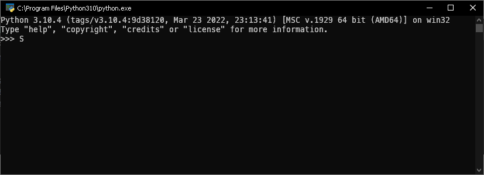

# Установка Python

## Установка на Windows

Я не буду долго зацикливаться на этом этапе. Скачать установщик можно на [python.org](https://www.python.org/downloads/windows/). Если качать Python с других сайтов, можно подцепить вирус или троян. Скачивайте программы только с официальных сайтов. После загрузки отметьте `Add to path` и проследуйте инструкциям. В windows 10 может появиться предупреждение с кнопкой щита (`Disable Length Limit `), стоит нажать на нее.

## Установка на Linux

Для каждого дистрибутива есть свой пакетный менеджер, попробуйте найти информацию в интернете

- `apt install python` - **ubuntu** и другие системы, использующие apt
- `pkg/apt install python` - **Термукс** (если вы собираетесь использовать телефон)
- `pacman -S python` - **arch** linux и другие системы, использующие pacman
- `yum install python` - **centos** и другие системы, использующие yum
- `dnf install python` - **fedora** и другие системы, использующие dnf
- `zypper install python` - **opensuse** и другие системы, использующие zypper

В случае ошибок прав используйте sudo в начале команды, что бы запустить процесс установки от имени администратора. В большинстве случаев вас попросят подтвердить операцию - введите Y и нажмите Enter.

## Проверка и интерактивный режим

В постах, где используется >>> и ... - используется интерактивный режим. Язык питон интерпретируемый (так же как и javascript, например) - то есть каждое действие в языке сначала читается, потом сразу выполняется. В других (компилируемых) языках (c++, java, etc...) сначала создается готовый файл, а потом его можно сразу запустить без дополнительных инструментов

> Компилятор (англ. compiler - составитель, собиратель) читает всю программу целиком, делает ее перевод и создает законченный вариант программы на машинном языке, который затем и выполняется. Результат работы компилятора — бинарный исполняемый файл.
> Интерпретатор (англ. interpreter - истолкователь, устный переводчик) переводит и выполняет программу строка за строкой.

Когда установка закончится, нужно проверить, что всё было сделано правильно. Для этого в командной строке наберите py (латиницей) или python и нажмите клавишу ввода. Если всё хорошо, в ответ Python вам напишет номер своей версии и сборки и предложит несколько команд для знакомства с собой:


Пожалуй, самый простой способ запускать программы на языке Python - это вводить инструкции непосредственно в командной строке интерпретатора, которая иногда называется интерактивной оболочкой. Например, выведем на экран "hello world" и рассмотрим парочку примеров:

```py
>>> print("Hello, world!")
Hello, world!
>>> # Это комментарий, пайтон ничего не делает
>>> # Или Попробуем вывести на экран число пять:
>>> 5
5
>>> # Посчитаем 2+2*2:
>>> 2+2*2
6
```

Заходя в пперед, есть более сложные операторы, которые требуют ввода на несколько строк, в таком случае, приглашение меняется с `>>>` на `...`. Этот режим продолжается до тех пор, пока вы не нажмете Enter, оставив пустую строку:

```py
>>> if 2+2*2 == 6:
...     print("Верно!")
... else:
...     print("Неверно!")
...
Верно!
```

## Запуск файлов

Алгоритм действий прост:

- Создаем файл любым способом. Файл должен оканчиваться на `.py`. Например, `hello.py`.
- Запускаем терминал/консоль (или запускаем прямо в папке с файлом)
  - Windows: `Windows` + `R` - Вводим `cmd` - Enter
  - Linux `Ctrl` + `Shift` + `T`
- Передвигаемся к файлу
  - Вариант 1: `cd ПОЛНЫЙ_ПУТЬ_К_ФАЙЛУ`
    - `cd C:\Users\Вася\Desktop\hello.py` - Windows
    - `cd /home/user/hello.py` - Linux
  - Вариант 2: Постепенно предвижение
    - `cd ВЛОЖЕННАЯ_ПАПКА` - перейти в папку
    - `cd ..` - для передвижения на уровень вверх
    - Linux `ls` / Windows `dir` - для просмотра содержимого папки
- Вводим команду для запуска файла
  - Вариант 1: `python hello.py` - универсальный метод для запуска любого файла на Python
  - Вариант 2: `python3 hello.py` - указываем, что используем имеено Python 3.x.x
  - Вариант 3: `py -3 hello.py` - лучший метод для Windows

Мои примеры будут приближены к Linux, поэтому мои действия:

```bash
~$ touch hello.py # Создаем файл
~$ nano hello.py # Открываем файл в редакторе nano, редактируем и сохраняем
~$ cat hello.py # Выводим содержимое файла
print("Hello, world!")
~$ python hello.py # Запускаем файл
Hello, world!
```

## Завершение

Статья может быть моментами неточной. Я буду рад почитать ваши комментари :)
