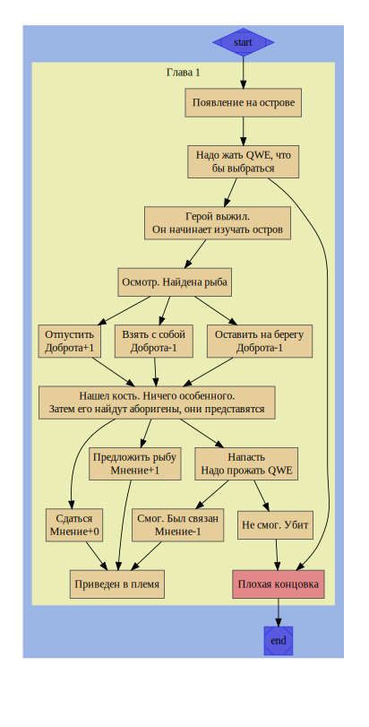

# Сюжет

## Идея

Главный герой терпит крушение и попадает на остров. Он натыкается на одно из поселений а позже обнаруживает второе. В итоге герой выясняет, что эти поселения когда то имели тесный контакт, но сейчас они враждуют и грядет война, в которой будет убито много невинных. Как герой выберется с острова и разрулит ли он эту ситуацию - зависит от действий

## 2) Глава 1

Герой появляется посреди океана, цепляясь за последнюю доску, он пытается добраться до острова, который, кажется совсем недалеко. С первых же минут игры уже встречаются трудности: что бы гребсти - нужно быстро нажимать на клавишу, иначе - конец

## 3) Известные персонажи и места

**Главный герой**
Имя: Саймон
Не заполнены характеристика, внешность, характер, цели, мотивация
**Поселение А**
Нет названия, характеристики
**Поселение Б**
Нет названия, характеристики

| Герой              | Имя, возраст, пр. | Описание                                                                                                                     | Мотивация                                              |
| ------------------ | ----------------- | ---------------------------------------------------------------------------------------------------------------------------- | ------------------------------------------------------ |
| 👤 Главный герой 1 | Саймон            | Главный герой игры. Попадает на остров, так как его корабль был разрушен                                                     | Хочет выжить и вернуться домой, построив новый корабль |
| 👤 Главный герой 2 | Даниель           | Так же главный герой игры. Является играбельным                                                                              | Хочет покинуть рабство                                 |
| 👤 Главный герой 3 |                   | Нет информации                                                                                                               |                                                        |
| 🏠 Поселение 1     | -                 | Нет никакой информации                                                                                                       | Хотят развязать войну с поселением 2                   |
| 🏠 Поселение 2     | -                 | Нет никакой информации                                                                                                       | Хотят развязать войну с поселением 1                   |
| 👥 Аборигены       | -                 | Населяют поселения. Говорят на ломанном языке, так как были обучены иностранцами, которые на данный момент находятся в плену | Мотивация привязана к поселению                        |
| 👥 Пленные         | -                 | Иностранцы. Рабы, работающие на поселения. Обучили языку. Лор неизвестен                                                     | ⚠ Хотят устроить бунт                                  |

